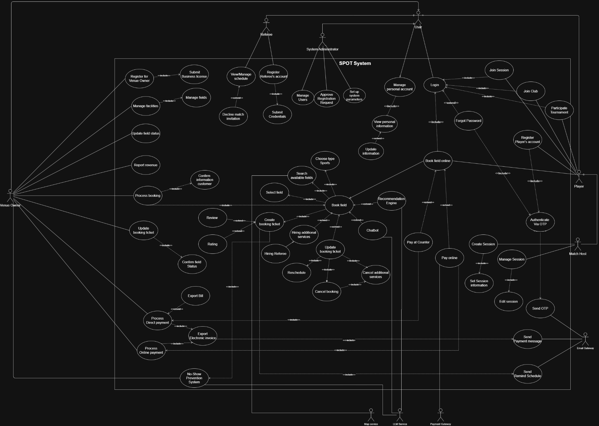
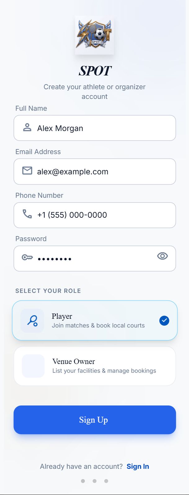
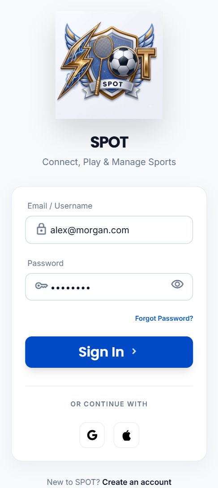
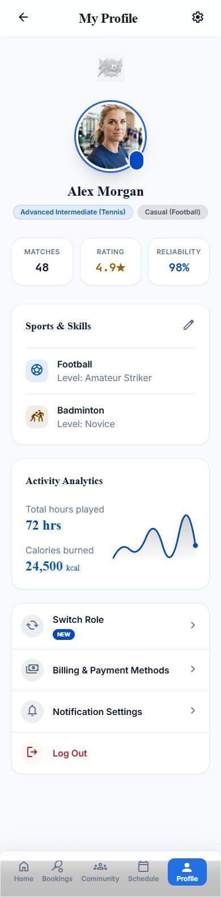
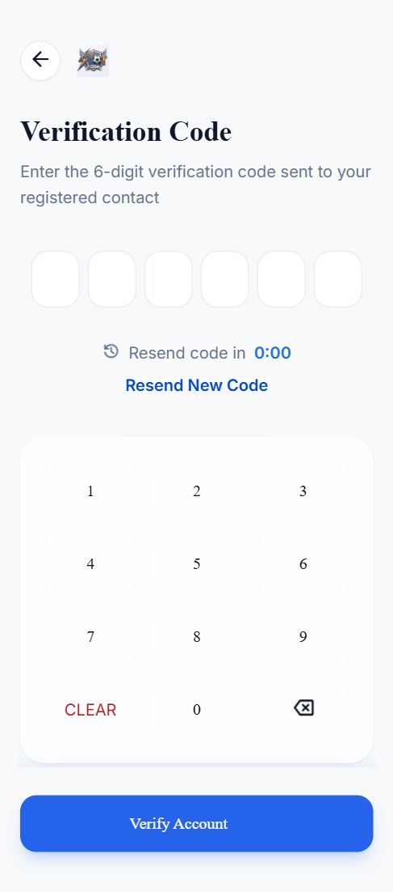
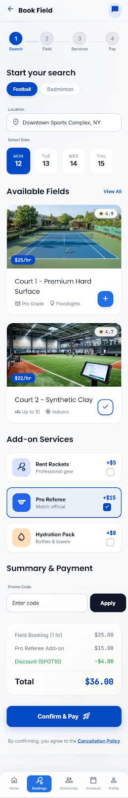
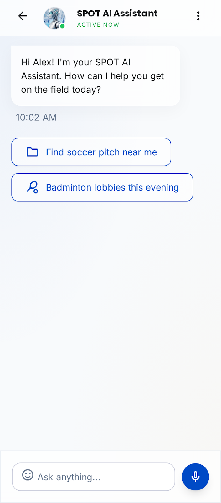
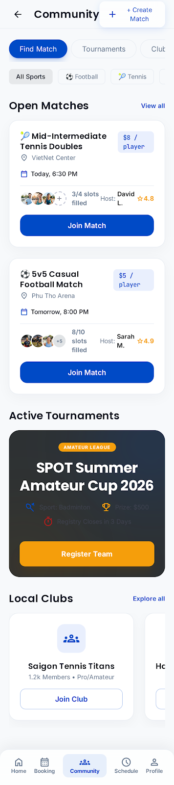

**Introduction to Software Engineering**

*Prepared by:  *
Nguyễn Thái Cường (24127336)  
Nguyễn Thanh Tùng (24127583)  
Đỗ Trương Khoa (24127423)  
K’Vớn (24127593)  
Đào Hoàng Phúc (24127496)

> *Instructor*:  
> Dr. Trần Duy Hoàng  
> MSc. Trương Phước Lộc  
> MSc. Phạm Hoàng Hải

**Table of Contents**

[**Objectives 1**](#objectives)

[**1 Member Contribution Assessment 2**](#member-contribution-assessment)

[**2 Problem Statement 3**](#problem-statement)

[**3 Requirements Overview 5**](#requirements-overview)

> [3.1 Stakeholders 5](#)
>
> [3.2 Requirements 8](#)
>
> [3.2.1. Functional Requirements Specification 8](#functional-requirements-specification)
>
> [3.2.2. Non-Functional Requirements Specification 11](#non-functional-requirements-specification)

[**4 Requirements Analysis 13**](#requirements-analysis)

> [4.1 Use Case model 13](#)
>
> [4.2 Use Case Specification 14](#)
>
> [4.2.1. Authentication & Account Management 14](#authentication-account-management)
>
> [4.2.2. Venue Search, Booking & Venue Operations 22](#venue-search-booking-venue-operations)
>
> [4.2.3. Matchmaking 35](#matchmaking)
>
> [4.2.4. Payment & Deposit 39](#payment-deposit)
>
> [4.2.5. Notification & No-Show Prevention 43](#notification-no-show-prevention)
>
> [4.2.6. Reviews & Ratings 46](#reviews-ratings)
>
> [4.2.7. Referee Operations 47](#referee-operations)
>
> [4.2.8. System Administration 49](#system-administration)

[**5 Prototype/Mockup 51**](#prototypemockup)

**Software Requirements Specification**

# **Objectives**

This document focus on the following topics:

- Complete the Software Requirements Specification (SRS) document with the following contents:

  - Elaborate on the Problem Statement

  - Overview of Requirements (Functional and Non-Functional), Stakeholders

  - Use Case Model

  - Use Case Specifications

  - Create Prototype and Mockup Diagrams of the System Interface

- Đọc hiểu tài liệu phân tích yêu cầu.

# **Member Contribution Assessment**

| **ID** | **Name** | **Assign ticket** | **Contribution (%)** |
|----|----|----|----|
| 24127336 | Nguyễn Thái Cường | \[[\#10](https://spot09.atlassian.net/browse/SPOT-10)\]\[[\#11](https://spot09.atlassian.net/browse/SPOT-11)\]\[[\#12](https://spot09.atlassian.net/browse/SPOT-12)\]\[[\#13](https://spot09.atlassian.net/browse/SPOT-13)\]\[[\#14](https://spot09.atlassian.net/browse/SPOT-14)\]  | 100 % |
| 24127583 | Nguyễn Thanh Tùng | \[[\#10](https://spot09.atlassian.net/browse/SPOT-10)\]\[[\#11](https://spot09.atlassian.net/browse/SPOT-11)\]\[[\#12](https://spot09.atlassian.net/browse/SPOT-12)\] | 100 % |
| 24127423 | Đỗ Trương Khoa | \[[\#11](https://spot09.atlassian.net/browse/SPOT-11)\] | 100 % |
| 24127593 | K’Vớn | \[[\#15](https://spot09.atlassian.net/browse/SPOT-15)\] | 100 % |
| 24127496 | Đào Hoàng Phúc | \[[\#12](https://spot09.atlassian.net/browse/SPOT-12)\] | 100 % |

# **Problem Statement**

> The demand for sports activities is consistently growing, yet the traditional process of finding, booking, and managing sports venues remains manual and inefficient. Currently, users often have to rely on direct phone calls to confirm bookings, which is time-consuming and lacks convenience. Furthermore, players struggle to find high-quality venues that fit their specific needs regarding location, budget, and sport type. Another significant challenge is the lack of a platform for solo players or teams to connect and arrange friendly matches.
>
> On the operational side, venue owners face difficulties in efficiently managing their schedules, verifying customer identities, and tracking business performance. The absence of automated notifications and detailed revenue analytics by sport type hinders their ability to optimize operations
>
> To address these fundamental issues, we propose the development of **SPOT  
> (Sport Pitch Online Ticketing)** - a comprehensive **Online Sports Venue Booking Management System**. The **SPOT** platform aims to digitize and streamline the entire booking ecosystem, allowing users to independently **book venues online**, view real-time **available time slots**, and utilize **advanced search filters**. To foster sportsmanship, **SPOT** will also introduce a dedicated **matchmaking feature** connecting different sports groups and solo players.
>
> For administrators and venue owners, **SPOT** will provide robust management tools, including **automated booking notifications**, detailed **customer verification**, and **monthly revenue statistics**. To mitigate operational risks and revenue loss from unfulfilled appointments, the platform will implement a **Smart No-Show Prevention System**. To ensure a high-quality user experience and safety, the platform will enforce strict security protocols (such as **OTP** for sensitive actions and **brute-force prevention**), maintain a fast response time of under 3 seconds, and implement **role-based access control**. Finally, **SPOT** will differentiate itself by leveraging advanced AI capabilities, including a **personalized recommendation engine** based on user activity and an **NLP-powered virtual assistant** for a quick, hands-free booking experience
>
> To successfully implement the proposed architecture and ensure system maintainability, SPOT will be built upon a modern and highly scalable technology stack. The client-side interfaces will be developed using **React and Next.js** for the Web application and Admin Console, alongside **React Native** to deliver a seamless, high-performance cross-platform Mobile App. On the server side, the API Gateway and Core Business Services will be powered by **Node.js and Express**, ensuring fast, non-blocking operations.
>
> Data persistence will rely on **PostgreSQL** for robust transactional integrity, complemented by **Redis** for high-speed caching to guarantee the sub-3-second response time requirement. Crucially, the AI-driven components—specifically the Smart No-Show Prevention System and the Recommendation Engine—will be developed using **Python** (incorporating libraries like scikit-learn and XGBoost) to effectively handle complex data classification, decision-making logic, and predictive modeling. The NLP virtual assistant will integrate with state-of-the-art LLM APIs such as **Gemini / GPT**. Finally, the entire ecosystem will be containerized using **Docker** and hosted on **Vercel** to streamline continuous deployment and cloud operations.

# **Requirements Overview**

#### ***Stakeholders***

| **STT** | **Stakeholder** | **Type** | **View Point** | **Description** |
|----|----|----|----|----|
| 1 | User | Abstract | Interactor | Generalized actor representing any individual account holder in the system, serves as the parent role from which Player and other specific user roles are derived through generalization. Handles common actions such as login and personal account management. |
| 2 | Player | Primary | Interactor | Players can register for an account and use the system immediately without requiring approval, as they represent a low-risk general user group. Their primary activities include searching for venues, online booking, registering for add-on services, participating in matchmaking, and processing payments. |
| 3 | Match Host | Primary | Interactor | A specialization of the Player actor that emerges when a user organizes a match rather than merely participating. In addition to all Player privileges, this actor manages member invitations and books the venue on behalf of the group. |

| 4 | Venue Owner | Primary | Interactor | This actor consolidates on-site operational roles (manager, receptionist, cashier, technician) into a single entity to simplify the model, reflecting the real-world scenario where these duties are often handled by the same person or a small team. As it represents a legitimate business entity, this actor's account requires Admin verification before it is permitted to operate publicly on the system. |
|----|----|----|----|----|
| 5 | Referee | Primary | Interactor | The Referee has a relatively narrow operational scope compared to other actors, primarily involving viewing assigned schedules and responding (accepting or declining shifts). Because this role involves publicly displayed professional credibility, their accounts also require Admin verification before going live on the platform, similar to the Venue Owner. |
| 6 | System Administrator | Primary | Interactor | Operating from a platform management perspective, this actor is responsible for reviewing and approving sensitive accounts such as Referees and Venue Owners, while also configuring global system parameters. |
| 7 | Map Service | Secondary | Indirect | It does not initiate interactions but is only invoked by the system when needed to determine locations or filter venues based on a travel radius. |
| 8 | Payment Gateway | Secondary | Indirect | Acting as an intermediary for processing financial transactions, it only responds when a payment request is sent from the system and does not initiate any actions independently. |
| 9 | Email Gateway | Secondary | Indirect | Serves as an external notification transmission channel, triggered whenever the system needs to send booking confirmations, OTP codes. |
| 10 | LLM Service | Secondary | Indirect | Provides natural language processing (NLP) capabilities for the virtual assistant, operating as a background service that powers the user's chat, voice experiences, and Smart No-Show prevention system. |

####  

#### ***Requirements***

##### ***Functional Requirements Specification***

<table>
<colgroup>
<col style="width: 13%" />
<col style="width: 86%" />
</colgroup>
<thead>
<tr>
<th style="text-align: center;"><em>No. FR</em></th>
<th style="text-align: center;"><em>Functional Requirements Specification</em></th>
</tr>
<tr>
<th style="text-align: center;"><em>FR-1</em></th>
<th style="text-align: center;"><em><strong>Authentication &amp; Account Management</strong></em></th>
</tr>
<tr>
<th style="text-align: center;">FR-1.1</th>
<th style="text-align: left;">The system shall allow any User to log in using registered credentials 
(email/username + password)</th>
</tr>
<tr>
<th style="text-align: center;">FR-1.2</th>
<th style="text-align: left;">The system shall allow a Player to self-register an account, which becomes active immediately without requiring approval.</th>
</tr>
<tr>
<th style="text-align: center;">FR-1.3</th>
<th style="text-align: left;">The system shall allow a Venue Owner or Referee to submit a registration request, which remains in "pending" status until reviewed and approved by a System Administrator before the account can operate publicly.</th>
</tr>
<tr>
<th style="text-align: center;">FR-1.4</th>
<th style="text-align: left;">The system shall require the user to re-confirm their password or enter an OTP before performing sensitive actions (e.g., changing email, phone number, payment information) via email.</th>
</tr>
<tr>
<th style="text-align: center;">FR-1.5</th>
<th style="text-align: left;">The system must support a forgotten password feature with an OTP sent via email.</th>
</tr>
<tr>
<th style="text-align: center;">FR-1.6</th>
<th style="text-align: left;">The system shall lock an account temporarily after a defined number of consecutive failed login attempts, to prevent brute-force attacks.</th>
</tr>
<tr>
<th style="text-align: center;">FR-1.7</th>
<th style="text-align: left;">The system shall allow every actor to view and update their own personal account information.</th>
</tr>
<tr>
<th style="text-align: center;"><em>FR-2</em></th>
<th style="text-align: center;"><em><strong>Venue Search &amp; Booking</strong></em></th>
</tr>
<tr>
<th style="text-align: center;">FR-2.1</th>
<th>The system shall allow a Player to search for venues using filters including sport type, location/radius, rating, and price range.</th>
</tr>
<tr>
<th style="text-align: center;">FR-2.2</th>
<th>The system shall display the real-time availability schedule of a venue by day/week upon accessing the venue details page.</th>
</tr>
<tr>
<th style="text-align: center;">FR-2.3</th>
<th>The system shall allow a Player to view comprehensive venue details, including a list of available add-on services (e.g., referee hiring).</th>
</tr>
<tr>
<th style="text-align: center;">FR-2.4</th>
<th>The system shall allow a Player to book a venue online independently, without requiring a phone call for confirmation.</th>
</tr>
<tr>
<th style="text-align: center;">FR-2.5</th>
<th>The system shall allow a Player to modify or cancel their own booking within the policy defined by the Venue Owner.</th>
</tr>
<tr>
<th style="text-align: center;">FR-2.6</th>
<th>The system shall generate a booking confirmation and allow it to be sent electronically.</th>
</tr>
<tr>
<th style="text-align: center;">FR-2.7</th>
<th>The system shall temporarily lock a selected time slot for a predefined duration (e.g., 5 minutes) while a Player is completing the payment or confirmation process to prevent double-booking.</th>
</tr>
<tr>
<th style="text-align: center;"><em>FR-3</em></th>
<th style="text-align: center;"><em><strong>Matchmaking</strong></em></th>
</tr>
<tr>
<th style="text-align: center;">FR-3.1</th>
<th>The system shall allow a Match Host (a Player who organizes a session) to create a "kèo" (open session) by selecting a booked venue, time slot, maximum number of slots, price per slot, and required skill-level range.</th>
</tr>
<tr>
<th style="text-align: center;">FR-3.2</th>
<th>The system shall allow a Player to search and filter open sessions by sport type, skill level, cost, location, and time.</th>
</tr>
<tr>
<th style="text-align: center;">FR-3.3</th>
<th>The system shall allow the Match Host to edit or cancel a session they created, and to view the current list of registered participants.</th>
</tr>
<tr>
<th style="text-align: center;">FR-3.4</th>
<th>The system shall allow the Match Host to remove a participant from a session when necessary (e.g., policy violation, no-show history).</th>
</tr>
<tr>
<th style="text-align: center;">FR-3.5</th>
<th>The system shall record each Player's match history, including participation count and basic performance statistics, for future display and recommendation purposes</th>
</tr>
<tr>
<th style="text-align: center;">FR-3.6</th>
<th>The system shall allow a Player to search for and join existing clubs/groups based on sport type, location, or skill level.</th>
</tr>
<tr>
<th style="text-align: center;">FR-3.7</th>
<th>The system shall allow the Match Host to approve or reject registration requests when the session is configured as "approval required."</th>
</tr>
<tr>
<th style="text-align: center;">FR-3.8</th>
<th>The system shall allow a Player or club to search for upcoming tournaments filtered by sport type, location, date range, and entry format (singles/doubles/team).</th>
</tr>
<tr>
<th style="text-align: center;">FR-3.9</th>
<th>The system shall allow a Player or club to register for a tournament directly through the platform. </th>
</tr>
<tr>
<th style="text-align: center;"><em>FR-4</em></th>
<th style="text-align: center;"><em><strong>Payment &amp; Deposit</strong></em></th>
</tr>
<tr>
<th style="text-align: center;">FR-4.1</th>
<th>The system shall allow a Player to pay for a booking or a matchmaking slot online through an integrated Payment Gateway (e.g., VNPay/MoMo).</th>
</tr>
<tr>
<th style="text-align: center;">FR-4.2</th>
<th>The system shall allow a Venue Owner to set a deposit amount</th>
</tr>
<tr>
<th style="text-align: center;">FR-4.3</th>
<th>The system shall generate an electronic invoice/receipt for every completed payment. </th>
</tr>
<tr>
<th style="text-align: center;"><em>FR-5</em></th>
<th style="text-align: center;"><em><strong>Notification</strong></em></th>
</tr>
<tr>
<th style="text-align: center;">FR-5.1</th>
<th>The system shall send a notification to the Venue Owner for every new booking received.</th>
</tr>
<tr>
<th style="text-align: center;">FR-5.2</th>
<th>The system shall send an OTP or confirmation message via the Email Gateway when a user performs a sensitive action or completes a booking.</th>
</tr>
<tr>
<th style="text-align: center;">FR-5.3</th>
<th>The system shall send a reminder notification to Players before the scheduled time of a booking or matchmaking session.</th>
</tr>
<tr>
<th style="text-align: center;"><em>FR-6</em></th>
<th style="text-align: center;"><em><strong>Reviews &amp; Ratings</strong></em></th>
</tr>
<tr>
<th style="text-align: center;">FR-6.1</th>
<th>The system shall allow a Player to rate and leave a review of a venue after completing a booking.</th>
</tr>
<tr>
<th style="text-align: center;">FR-6.2</th>
<th>The system shall allow the Venue Owner to view and respond to reviews of their venue.</th>
</tr>
<tr>
<th style="text-align: center;"><em>FR-7</em></th>
<th style="text-align: center;"><em><strong>Venue &amp; Operations Management</strong></em></th>
</tr>
<tr>
<th style="text-align: center;">FR-7.1</th>
<th>The system shall allow the Venue Owner to manage venue/facility profiles, court schedules.</th>
</tr>
<tr>
<th style="text-align: center;">FR-7.2</th>
<th>The system shall allow the Venue Owner to view, modify, or cancel any customer's booking to support schedule management.</th>
</tr>
<tr>
<th style="text-align: center;">FR-7.3</th>
<th>The system shall allow the Venue Owner to verify a customer's identity using the booking's associated name and phone number.</th>
</tr>
<tr>
<th style="text-align: center;">FR-7.4</th>
<th>The system shall allow the Venue Owner to view a monthly revenue chart broken down by sport type.</th>
</tr>
<tr>
<th style="text-align: center;">FR-7.5</th>
<th>The system shall allow the Venue Owner to confirm check-in status for a booked court.</th>
</tr>
<tr>
<th style="text-align: center;"><em>FR-8</em></th>
<th style="text-align: center;"><em><strong>Referee Operations</strong></em></th>
</tr>
<tr>
<th style="text-align: center;">FR-8.1</th>
<th>The system shall allow a Referee to view their assigned match/shift schedule.</th>
</tr>
<tr>
<th style="text-align: center;">FR-8.2</th>
<th>The system shall allow a Referee to accept or submit a cancellation request for an assigned shift.</th>
</tr>
<tr>
<th style="text-align: center;"><em>FR-9</em></th>
<th style="text-align: center;"><em><strong>System Administration</strong></em></th>
</tr>
<tr>
<th style="text-align: center;">FR-9.1</th>
<th>The system shall allow the System Administrator to review and approve or reject registration requests submitted by Venue Owners and Referees.</th>
</tr>
<tr>
<th style="text-align: center;">FR-9.2</th>
<th>The system shall allow the System Administrator to manage user accounts and assign role-based access permissions (RBAC).</th>
</tr>
<tr>
<th style="text-align: center;">FR-9.3</th>
<th>The system shall allow the System Administrator to configure global system parameters and operational policies.</th>
</tr>
<tr>
<th style="text-align: center;"><em>FR-10</em></th>
<th style="text-align: center;"><em><strong>AI-Powered Services</strong></em></th>
</tr>
<tr>
<th style="text-align: center;">FR-10.1</th>
<th>The system shall analyze a Player's activity history to generate personalized venue and matchmaking session recommendations.</th>
</tr>
<tr>
<th style="text-align: center;">FR-10.2</th>
<th>The system shall provide an NLP-powered virtual assistant (chatbot/voice bot) that allows a Player to complete a booking through natural conversation.</th>
</tr>
<tr>
<th style="text-align: center;">FR-10.3</th>
<th>The system shall estimate the no-show probability of a booking and use this prediction to dynamically adjust the required deposit amount.</th>
</tr>
</thead>
<tbody>
</tbody>
</table>

##### ***Non-Functional Requirements Specification***

<table>
<colgroup>
<col style="width: 13%" />
<col style="width: 86%" />
</colgroup>
<thead>
<tr>
<th style="text-align: center;"><em>No. NFR</em></th>
<th style="text-align: center;"><em>Functional Requirements Specification</em></th>
</tr>
<tr>
<th style="text-align: center;"><em>NFR-1</em></th>
<th style="text-align: center;"><em><strong>Performance</strong></em></th>
</tr>
<tr>
<th style="text-align: center;">NFR-1.1</th>
<th>Response time &lt;= 3 seconds for 95% of requests (P95) and search/filter queries ≤ 1.5 seconds (P95).</th>
</tr>
<tr>
<th style="text-align: center;">NFR-1.2</th>
<th>Booking creation transaction completes end-to-end in &lt;= 2 seconds under normal load.</th>
</tr>
<tr>
<th style="text-align: center;">NFR-1.3</th>
<th>System supports up to 500 concurrent users with response time still ≤ 3 seconds (P95) 
AI services scale independently from core services without downtime.</th>
</tr>
<tr>
<th style="text-align: center;">NFR-1.4</th>
<th>The OTP code must be sent to the user within 10 seconds of pressing the submit 
request button</th>
</tr>
<tr>
<th style="text-align: center;"><em>NFR-2</em></th>
<th style="text-align: center;"><em><strong>Security</strong></em></th>
</tr>
<tr>
<th style="text-align: center;">NFR-2.1</th>
<th>100% of sensitive actions (change email/phone/payment info) require OTP or password 
re-confirmation</th>
</tr>
<tr>
<th style="text-align: center;">NFR-2.2</th>
<th>100% of API endpoints validate JWT and role permissions before granting access; unauthorized attempts return HTTP 403.</th>
</tr>
<tr>
<th style="text-align: center;">NFR-2.3</th>
<th>Account locked for 15 minutes after 5 consecutive failed login attempts</th>
</tr>
<tr>
<th style="text-align: center;">NFR-2.4</th>
<th>100% of client-server traffic uses HTTPS/TLS 1.2+; passwords stored using bcrypt/Argon2 hashing (never plaintext).</th>
</tr>
<tr>
<th style="text-align: center;">NFR-2.5</th>
<th>Passwords must be at least 8 characters long, including uppercase, lowercase, numbers and special characters</th>
</tr>
<tr>
<th style="text-align: center;"><em>NFR-3</em></th>
<th style="text-align: center;"><em><strong>Usability</strong></em></th>
</tr>
<tr>
<th style="text-align: center;">NFR-3.1</th>
<th style="text-align: left;">&gt;= 90% task-completion rate for first-time users completing an online booking within 5 minutes (tested with &gt;= 10 participants).</th>
</tr>
<tr>
<th style="text-align: center;">NFR-3.2</th>
<th style="text-align: left;">100% of form validation errors display a specific</th>
</tr>
<tr>
<th style="text-align: center;"><em>NFR-4</em></th>
<th style="text-align: center;"><em><strong>Reliability</strong></em></th>
</tr>
<tr>
<th style="text-align: center;">NFR-4.1</th>
<th>System uptime &gt;= 99% measured monthly</th>
</tr>
<tr>
<th style="text-align: center;">NFR-4.2</th>
<th>0% double-booking rate for the same venue/time-slot under concurrent booking load tests 
(&gt;= 50 simultaneous requests).</th>
</tr>
<tr>
<th style="text-align: center;"><em>NFR-5</em></th>
<th style="text-align: center;"><em><strong>Maintainability</strong></em></th>
</tr>
<tr>
<th style="text-align: center;">NFR-5.1</th>
<th>&gt;= 80% of backend modules covered by linting rules (ESLint/Prettier for Node.js, PEP8 for Python); code review required before merging to main branch.</th>
</tr>
<tr>
<th style="text-align: center;"><em>NFR-6</em></th>
<th style="text-align: center;"><em><strong>Portability</strong></em></th>
</tr>
<tr>
<th style="text-align: center;">NFR-6.1</th>
<th>Verified on the latest 2 versions of Chrome with no critical UI defects.</th>
</tr>
<tr>
<th style="text-align: center;">NFR-6.2</th>
<th>All services containerized with Docker; deployable to any Docker-compatible host (Vercel, DigitalOcean, Azure) with &lt;= 1 config file change.</th>
</tr>
<tr>
<th style="text-align: center;"><em>NFR-7</em></th>
<th style="text-align: center;"><em><strong>Compliance</strong></em></th>
</tr>
<tr>
<th style="text-align: center;">NFR-7.1</th>
<th>User data handling complies with Vietnam's Personal Data Protection Decree (Decree 13/2023/NĐ-CP); no third-party data sharing without explicit user consent.</th>
</tr>
</thead>
<tbody>
</tbody>
</table>

#  

# **Requirements Analysis**

#### ***Use Case model***

- Link Use case diagram: [<u>Use case SPOT.png</u>](https://drive.google.com/file/d/1ZpMb_xS6h5a1InzaTdpz0bALrryuGcVT/view?usp=sharing)

#### ***Use Case Specification***

##### ***Authentication & Account Management*** 

<table>
<colgroup>
<col style="width: 32%" />
<col style="width: 67%" />
</colgroup>
<thead>
<tr>
<th style="text-align: left;"><em><strong>Use case ID</strong></em></th>
<th style="text-align: left;"><strong>U001</strong></th>
</tr>
<tr>
<th style="text-align: left;"><em>Use Case</em></th>
<th><strong>Login</strong></th>
</tr>
<tr>
<th style="text-align: left;"><em>Brief Description</em></th>
<th>Allows a registered account holder to authenticate into SPOT using registered credentials (email/phone + password) in order to access role-specific features</th>
</tr>
<tr>
<th style="text-align: left;"><em>Actor</em></th>
<th>User (Player, Venue Owner, Referee, System Administrator)</th>
</tr>
<tr>
<th style="text-align: left;"><em>Pre-Condition</em></th>
<th><ul>
<li>
The user already has a registered account
</li>
<li>
For Venue Owner and Referee accounts, the registration request has already been approved by the System Administrator 
(status = active)
</li>
</ul></th>
</tr>
<tr>
<th style="text-align: left;"><em>Result</em></th>
<th><ul>
<li>
A valid session (JWT) is issued to the user
</li>
<li>
The user is redirected to the home screen corresponding to their role
</li>
</ul></th>
</tr>
<tr>
<th style="text-align: left;"><em>Main Scenario</em></th>
<th><ol type="1">
<li>
User opens the Login screen and enters email/username and password.
</li>
<li>
System validates the input format.
</li>
<li>
System looks up the account and compares the password hash.
</li>
<li>
System checks the account status 
(active / pending / locked).
</li>
<li>
System issues a session token (JWT) and redirects the user to their role-based dashboard.
</li>
</ol></th>
</tr>
<tr>
<th style="text-align: left;"><em>Alternative Scenarios</em></th>
<th><ol type="1">
<li>
<em>Invalid credentials</em>
</li>
</ol>

System rejects the attempt, displays a generic error message, and increments the failed-attempt counter for the account

<ol start="2" type="1">
<li>
<em>Account locked</em>
</li>
</ol>

After 5 consecutive failed attempts, system locks the account for 15 minutes and informs the user (NFR-2.3)

<ol start="3" type="1">
<li>
<em>Forgotten password</em>
</li>
</ol>

User selects "Forgot Password"; flow continues at UC "Forgot Password"

<ol start="4" type="1">
<li>
<em>Pending approval</em>
</li>
</ol>

If a Venue Owner/Referee account is still "pending", system denies login and shows a pending-approval notice
</th>
</tr>
<tr>
<th style="text-align: left;"><em>Non-Functional Constraints</em></th>
<th><ul>
<li>
NFR-1.1 (login response ≤ 3s, P95)
</li>
<li>
NFR-2.2 (JWT + role validation on every subsequent request)
</li>
<li>
NFR-2.3 (lockout policy)
</li>
<li>
NFR-2.4 (HTTPS/TLS, password hashing with bcrypt/Argon2)
</li>
</ul></th>
</tr>
</thead>
<tbody>
</tbody>
</table>

<table>
<colgroup>
<col style="width: 32%" />
<col style="width: 67%" />
</colgroup>
<thead>
<tr>
<th style="text-align: left;"><em><strong>Use case ID</strong></em></th>
<th style="text-align: left;"><strong>U002</strong></th>
</tr>
<tr>
<th style="text-align: left;"><em>Use Case</em></th>
<th><strong>Forgot Password</strong></th>
</tr>
<tr>
<th style="text-align: left;"><em>Brief Description</em></th>
<th>Lets a user who cannot remember their password reset it after verifying ownership of the registered email/phone through an OTP</th>
</tr>
<tr>
<th style="text-align: left;"><em>Actor</em></th>
<th>User</th>
</tr>
<tr>
<th style="text-align: left;"><em>Pre-Condition</em></th>
<th><ul>
<li>
The user owns a registered, previously verified email
</li>
</ul></th>
</tr>
<tr>
<th style="text-align: left;"><em>Result</em></th>
<th><ul>
<li>
The account password is reset and the user can log in with the new password
</li>
</ul></th>
</tr>
<tr>
<th style="text-align: left;"><em>Main Scenario</em></th>
<th><ol type="1">
<li>
User selects "Forgot Password" from the Login screen.
</li>
<li>
User enters the registered email/phone number.
</li>
<li>
System triggers UC "Send OTP" through the Email Gateway.
</li>
<li>
User enters the received OTP.
</li>
<li>
System verifies the OTP through UC "Authenticate via OTP"
</li>
<li>
User enters and confirms a new password.
</li>
<li>
System hashes and stores the new password, then confirms success.
</li>
</ol></th>
</tr>
<tr>
<th style="text-align: left;"><em>Alternative Scenarios</em></th>
<th><ol type="1">
<li>
<em>Wrong OTP</em>
</li>
</ol>

System allows up to 3 retries before temporarily blocking the request.

<ol start="2" type="1">
<li>
<em>Expired OTP</em>
</li>
</ol>

User requests the OTP to be resent; a new OTP invalidates the previous one.
</th>
</tr>
<tr>
<th style="text-align: left;"><em>Non-Functional Constraints</em></th>
<th><ul>
<li>
NFR-2.1 (OTP re-confirmation for sensitive actions)
</li>
<li>
NFR-2.4 (HTTPS/TLS, hashed password storage)
</li>
</ul></th>
</tr>
</thead>
<tbody>
</tbody>
</table>

<table>
<colgroup>
<col style="width: 32%" />
<col style="width: 67%" />
</colgroup>
<thead>
<tr>
<th style="text-align: left;"><em><strong>Use case ID</strong></em></th>
<th><strong>U003</strong></th>
</tr>
<tr>
<th style="text-align: left;"><em>Use Case</em></th>
<th><strong>Authenticate via OTP</strong></th>
</tr>
<tr>
<th style="text-align: left;"><em>Brief Description</em></th>
<th>Verifies a one-time password sent to the user's registered contact in order to confirm login recovery or another sensitive action</th>
</tr>
<tr>
<th style="text-align: left;"><em>Actor</em></th>
<th>User, Email Gateway (secondary)</th>
</tr>
<tr>
<th style="text-align: left;"><em>Pre-Condition</em></th>
<th><ul>
<li>
An OTP has already been generated and dispatched to the user 
(UC "Send OTP")
</li>
</ul></th>
</tr>
<tr>
<th style="text-align: left;"><em>Result</em></th>
<th><ul>
<li>
The pending sensitive action is allowed to proceed only if the submitted OTP is correct and unexpired
</li>
</ul></th>
</tr>
<tr>
<th style="text-align: left;"><em>Main Scenario</em></th>
<th><ol type="1">
<li>
System generates a 6-digit OTP with a limited validity window (e.g., 5 minutes) and stores it against the request.
</li>
<li>
User submits the OTP received via email/SMS.
</li>
<li>
System compares the submitted value with the stored OTP and checks the expiry timestamp.
</li>
<li>
If the OTP matches and is still valid, system marks the verification as successful and resumes the calling use case.
</li>
</ol></th>
</tr>
<tr>
<th style="text-align: left;"><em>Alternative Scenarios</em></th>
<th><ol type="1">
<li>
<em>Expired OTP</em>
</li>
</ol>

System rejects the value and offers to resend a new OTP.

<ol start="2" type="1">
<li>
<em>Repeated wrong OTP</em>
</li>
</ol>

After 3 failed attempts, system temporarily blocks further attempts for that request.
</th>
</tr>
<tr>
<th style="text-align: left;"><em>Non-Functional Constraints</em></th>
<th><ul>
<li>
NFR-2.1
</li>
<li>
NFR-2.4
</li>
</ul></th>
</tr>
</thead>
<tbody>
</tbody>
</table>

<table>
<colgroup>
<col style="width: 32%" />
<col style="width: 67%" />
</colgroup>
<thead>
<tr>
<th style="text-align: left;"><em><strong>Use case ID</strong></em></th>
<th style="text-align: left;"><strong>U004</strong></th>
</tr>
<tr>
<th style="text-align: left;"><em>Use Case</em></th>
<th><strong>Manage Personal Account</strong></th>
</tr>
<tr>
<th style="text-align: left;"><em>Brief Description</em></th>
<th>Use case allowing any authenticated user to view and edit their own personal account information.</th>
</tr>
<tr>
<th style="text-align: left;"><em>Actor</em></th>
<th>User</th>
</tr>
<tr>
<th style="text-align: left;"><em>Pre-Condition</em></th>
<th><ul>
<li>
User is logged in.
</li>
</ul></th>
</tr>
<tr>
<th style="text-align: left;"><em>Result</em></th>
<th><ul>
<li>
The user's profile information is displayed and, if edited, persisted
</li>
</ul></th>
</tr>
<tr>
<th style="text-align: left;"><em>Main Scenario</em></th>
<th><ol type="1">
<li>
User opens "My Account".
</li>
<li>
System executes UC "View Personal Information"
</li>
<li>
User selects "Edit"; flow continues at UC "Update Information"
</li>
</ol></th>
</tr>
<tr>
<th style="text-align: left;"><em>Alternative Scenarios</em></th>
<th><ol type="1">
<li>
<em>Sensitive field changed</em>
</li>
</ol>

If email, phone, or payment information is changed, system requires OTP/password re-confirmation before saving (FR-1.4).
</th>
</tr>
<tr>
<th style="text-align: left;"><em>Non-Functional Constraints</em></th>
<th><ul>
<li>
NFR-2.1
</li>
<li>
NFR-3.2 (specific inline validation messages)
</li>
</ul></th>
</tr>
</thead>
<tbody>
</tbody>
</table>

<table>
<colgroup>
<col style="width: 32%" />
<col style="width: 67%" />
</colgroup>
<thead>
<tr>
<th style="text-align: left;"><em><strong>Use case ID</strong></em></th>
<th style="text-align: left;"><strong>U005</strong></th>
</tr>
<tr>
<th style="text-align: left;"><em>Use Case</em></th>
<th><strong>View Personal Information</strong></th>
</tr>
<tr>
<th style="text-align: left;"><em>Brief Description</em></th>
<th>Displays the profile data currently on record for the logged-in user</th>
</tr>
<tr>
<th style="text-align: left;"><em>Actor</em></th>
<th>User</th>
</tr>
<tr>
<th style="text-align: left;"><em>Pre-Condition</em></th>
<th><ul>
<li>
User is logged in
</li>
</ul></th>
</tr>
<tr>
<th style="text-align: left;"><em>Result</em></th>
<th><ul>
<li>
The user's name, contact details, and role-specific data are displayed
</li>
</ul></th>
</tr>
<tr>
<th style="text-align: left;"><em>Main Scenario</em></th>
<th><ol type="1">
<li>
System retrieves the account record from the database.
</li>
<li>
System renders the profile fields on screen.
</li>
</ol></th>
</tr>
<tr>
<th style="text-align: left;"><em>Alternative Scenarios</em></th>
<th><ol type="1">
<li>
<em>User requests changes</em>
</li>
</ol>

Flow continues at UC "Update Information"
</th>
</tr>
<tr>
<th style="text-align: left;"><em>Non-Functional Constraints</em></th>
<th><ul>
<li>
NFR-1.1
</li>
</ul></th>
</tr>
</thead>
<tbody>
</tbody>
</table>

<table>
<colgroup>
<col style="width: 32%" />
<col style="width: 67%" />
</colgroup>
<thead>
<tr>
<th style="text-align: left;"><em><strong>Use case ID</strong></em></th>
<th style="text-align: left;"><strong>U006</strong></th>
</tr>
<tr>
<th style="text-align: left;"><em>Use Case</em></th>
<th><strong>Update Information</strong></th>
</tr>
<tr>
<th style="text-align: left;"><em>Brief Description</em></th>
<th>Allows the user to edit and save changes to their own profile fields</th>
</tr>
<tr>
<th style="text-align: left;"><em>Actor</em></th>
<th>User</th>
</tr>
<tr>
<th style="text-align: left;"><em>Pre-Condition</em></th>
<th><ul>
<li>
User is viewing their personal information.
</li>
</ul></th>
</tr>
<tr>
<th style="text-align: left;"><em>Result</em></th>
<th><ul>
<li>
Updated profile data is persisted and reflected immediately.
</li>
</ul></th>
</tr>
<tr>
<th style="text-align: left;"><em>Main Scenario</em></th>
<th><ol type="1">
<li>
User edits one or more fields (name, avatar, address, etc.).
</li>
<li>
System validates the format of each field.
</li>
<li>
If a sensitive field (email/phone/payment info) is changed, system triggers UC "Authenticate via OTP"
</li>
<li>
System saves the changes and displays a success confirmation.
</li>
</ol></th>
</tr>
<tr>
<th style="text-align: left;"><em>Alternative Scenarios</em></th>
<th><ol type="1">
<li>
<em>Validation error</em>
</li>
</ol>

System highlights the invalid field with a specific error message and blocks saving (NFR-3.2).
</th>
</tr>
<tr>
<th style="text-align: left;"><em>Non-Functional Constraints</em></th>
<th><ul>
<li>
NFR-2.1
</li>
<li>
NFR-3.2
</li>
</ul></th>
</tr>
</thead>
<tbody>
</tbody>
</table>

<table>
<colgroup>
<col style="width: 32%" />
<col style="width: 67%" />
</colgroup>
<thead>
<tr>
<th style="text-align: left;"><em><strong>Use case ID</strong></em></th>
<th style="text-align: left;"><strong>U007</strong></th>
</tr>
<tr>
<th style="text-align: left;"><em>Use Case</em></th>
<th><strong>Register Player's Account</strong></th>
</tr>
<tr>
<th style="text-align: left;"><em>Brief Description</em></th>
<th>Allows a new visitor to self-register a Player account that becomes active immediately, without requiring administrator approval</th>
</tr>
<tr>
<th style="text-align: left;"><em>Actor</em></th>
<th>Player</th>
</tr>
<tr>
<th style="text-align: left;"><em>Pre-Condition</em></th>
<th><ul>
<li>
The visitor does not already hold an account with the same email/username
</li>
</ul></th>
</tr>
<tr>
<th style="text-align: left;"><em>Result</em></th>
<th><ul>
<li>
A new, active Player account is created.
</li>
</ul></th>
</tr>
<tr>
<th style="text-align: left;"><em>Main Scenario</em></th>
<th><ol type="1">
<li>
Guest opens the registration form and enters name, email/username, and password.
</li>
<li>
System validates the format of all fields and checks uniqueness of email/phone.
</li>
<li>
System creates the account with status = active.
</li>
<li>
System sends a welcome/confirmation notification and logs the user in.
</li>
</ol></th>
</tr>
<tr>
<th style="text-align: left;"><em>Alternative Scenarios</em></th>
<th><ol type="1">
<li>
<em>Duplicate account</em>
</li>
</ol>

System rejects the registration and suggests 
"Forgot Password" instead.
</th>
</tr>
<tr>
<th style="text-align: left;"><em>Non-Functional Constraints</em></th>
<th><ul>
<li>
NFR-1.1
</li>
<li>
NFR-2.4
</li>
</ul></th>
</tr>
</thead>
<tbody>
</tbody>
</table>

<table>
<colgroup>
<col style="width: 32%" />
<col style="width: 67%" />
</colgroup>
<thead>
<tr>
<th style="text-align: left;"><em><strong>Use case ID</strong></em></th>
<th style="text-align: left;"><strong>U008</strong></th>
</tr>
<tr>
<th style="text-align: left;"><em>Use Case</em></th>
<th><strong>Register for Venue Owner</strong></th>
</tr>
<tr>
<th style="text-align: left;"><em>Brief Description</em></th>
<th>Allows a business to submit a request to operate as a Venue Owner on the platform, which stays pending until reviewed by an Administrator</th>
</tr>
<tr>
<th style="text-align: left;"><em>Actor</em></th>
<th>Venue Owner</th>
</tr>
<tr>
<th style="text-align: left;"><em>Pre-Condition</em></th>
<th><ul>
<li>
Applicant does not already hold a Venue Owner account
</li>
</ul></th>
</tr>
<tr>
<th style="text-align: left;"><em>Result</em></th>
<th><ul>
<li>
A registration request with status = pending is created and queued for admin review
</li>
</ul></th>
</tr>
<tr>
<th style="text-align: left;"><em>Main Scenario</em></th>
<th><ol type="1">
<li>
Applicant fills in business information (name, address, contact person).
</li>
</ol>
<ol start="2" type="1">
<li>
System executes UC "Submit Business License"
</li>
<li>
System stores the request with status = pending and notifies the System Administrator.
</li>
</ol></th>
</tr>
<tr>
<th style="text-align: left;"><em>Alternative Scenarios</em></th>
<th><ol type="1">
<li>
<em>Missing license document</em>
</li>
</ol>

System blocks submission until a valid license file is attached.
</th>
</tr>
<tr>
<th style="text-align: left;"><em>Non-Functional Constraints</em></th>
<th><ul>
<li>
NFR-1.1
</li>
</ul></th>
</tr>
</thead>
<tbody>
</tbody>
</table>

<table>
<colgroup>
<col style="width: 32%" />
<col style="width: 67%" />
</colgroup>
<thead>
<tr>
<th style="text-align: left;"><em><strong>Use case ID</strong></em></th>
<th style="text-align: left;"><strong>U009</strong></th>
</tr>
<tr>
<th style="text-align: left;"><em>Use Case</em></th>
<th><strong>Submit Business License</strong></th>
</tr>
<tr>
<th style="text-align: left;"><em>Brief Description</em></th>
<th>Uploads the legal business license document required to verify a Venue Owner registration request</th>
</tr>
<tr>
<th style="text-align: left;"><em>Actor</em></th>
<th>Venue Owner</th>
</tr>
<tr>
<th style="text-align: left;"><em>Pre-Condition</em></th>
<th><ul>
<li>
Applicant is filling in the Venue Owner registration form.
</li>
</ul></th>
</tr>
<tr>
<th style="text-align: left;"><em>Result</em></th>
<th><ul>
<li>
The license file is stored and linked to the pending registration request.
</li>
</ul></th>
</tr>
<tr>
<th style="text-align: left;"><em>Main Scenario</em></th>
<th><ol type="1">
<li>
Applicant selects a file (PDF/image) of the business license.
</li>
<li>
System validates file type and size.
</li>
<li>
System uploads and attaches the file to the registration request.
</li>
</ol></th>
</tr>
<tr>
<th style="text-align: left;"><em>Alternative Scenarios</em></th>
<th><ol type="1">
<li>
<em>Unsupported file</em>
</li>
</ol>

System rejects the file and asks the applicant to try a supported format.
</th>
</tr>
<tr>
<th style="text-align: left;"><em>Non-Functional Constraints</em></th>
<th>None</th>
</tr>
</thead>
<tbody>
</tbody>
</table>

<table>
<colgroup>
<col style="width: 32%" />
<col style="width: 67%" />
</colgroup>
<thead>
<tr>
<th style="text-align: left;"><em><strong>Use case ID</strong></em></th>
<th><strong>U010</strong></th>
</tr>
<tr>
<th style="text-align: left;"><em>Use Case</em></th>
<th><strong>Register Referee's Account</strong></th>
</tr>
<tr>
<th style="text-align: left;"><em>Brief Description</em></th>
<th>Allows an individual to apply to become a Referee, with the account remaining pending until an Administrator approves it</th>
</tr>
<tr>
<th style="text-align: left;"><em>Actor</em></th>
<th>Referee</th>
</tr>
<tr>
<th style="text-align: left;"><em>Pre-Condition</em></th>
<th><ul>
<li>
Applicant does not already hold a Referee account.
</li>
</ul></th>
</tr>
<tr>
<th style="text-align: left;"><em>Result</em></th>
<th><ul>
<li>
A registration request with status = pending is created.
</li>
</ul></th>
</tr>
<tr>
<th style="text-align: left;"><em>Main Scenario</em></th>
<th><ol type="1">
<li>
Applicant fills in personal and professional information.
</li>
<li>
System executes UC "Submit Credentials" (&lt;&lt;include&gt;&gt;).
</li>
<li>
System stores the request as pending and notifies the System Administrator.
</li>
</ol></th>
</tr>
<tr>
<th style="text-align: left;"><em>Alternative Scenarios</em></th>
<th><ol type="1">
<li>
<em>Missing credentials</em>
</li>
</ol>

System blocks submission until certification documents are attached.
</th>
</tr>
<tr>
<th style="text-align: left;"><em>Non-Functional Constraints</em></th>
<th><ul>
<li>
NFR-1.1
</li>
</ul></th>
</tr>
</thead>
<tbody>
</tbody>
</table>

<table>
<colgroup>
<col style="width: 32%" />
<col style="width: 67%" />
</colgroup>
<thead>
<tr>
<th style="text-align: left;"><em><strong>Use case ID</strong></em></th>
<th><strong>U011</strong></th>
</tr>
<tr>
<th style="text-align: left;"><em>Use Case</em></th>
<th><strong>Submit Credentials</strong></th>
</tr>
<tr>
<th style="text-align: left;"><em>Brief Description</em></th>
<th>Uploads certification/qualification documents required to verify a Referee registration request.</th>
</tr>
<tr>
<th style="text-align: left;"><em>Actor</em></th>
<th>Referee</th>
</tr>
<tr>
<th style="text-align: left;"><em>Pre-Condition</em></th>
<th><ul>
<li>
Applicant is filling in the Referee registration form.
</li>
</ul></th>
</tr>
<tr>
<th style="text-align: left;"><em>Result</em></th>
<th><ul>
<li>
The credential file(s) are stored and linked to the pending registration request.
</li>
</ul></th>
</tr>
<tr>
<th style="text-align: left;"><em>Main Scenario</em></th>
<th><ol type="1">
<li>
Applicant selects certification file(s).
</li>
<li>
System validates file type and size.
</li>
<li>
System uploads and attaches the file(s) to the request.
</li>
</ol></th>
</tr>
<tr>
<th style="text-align: left;"><em>Alternative Scenarios</em></th>
<th><ol type="1">
<li>
<em>Unsupported file</em>
</li>
</ol>

System rejects the file and asks for a supported format.
</th>
</tr>
<tr>
<th style="text-align: left;"><em>Non-Functional Constraints</em></th>
<th><ul>
<li>
File type/size validation
</li>
</ul></th>
</tr>
</thead>
<tbody>
</tbody>
</table>

##### ***Venue Search, Booking & Venue Operations*** 

<table>
<colgroup>
<col style="width: 32%" />
<col style="width: 67%" />
</colgroup>
<thead>
<tr>
<th style="text-align: left;"><em><strong>Use case ID</strong></em></th>
<th style="text-align: left;"><strong>U012</strong></th>
</tr>
<tr>
<th style="text-align: left;"><em>Use Case</em></th>
<th><strong>Book Field Online</strong></th>
</tr>
<tr>
<th style="text-align: left;"><em>Brief Description</em></th>
<th>End-to-end use case that lets a Player independently search for, select, and pay for a field/court booking without needing a phone call</th>
</tr>
<tr>
<th style="text-align: left;"><em>Actor</em></th>
<th>Player, Match Host</th>
</tr>
<tr>
<th style="text-align: left;"><em>Pre-Condition</em></th>
<th><ul>
<li>
Player is logged in.
</li>
</ul></th>
</tr>
<tr>
<th style="text-align: left;"><em>Result</em></th>
<th><ul>
<li>
A confirmed booking ticket exists, with payment either completed online or scheduled for counter payment.
</li>
</ul></th>
</tr>
<tr>
<th style="text-align: left;"><em>Main Scenario</em></th>
<th><ol type="1">
<li>
System executes UC "Search Available Fields"
</li>
<li>
System executes UC "Choose Type Sports"
</li>
<li>
System executes UC "Select Field"
</li>
<li>
System executes UC "Book Field"
</li>
<li>
Player chooses a payment path; flow continues at UC "Pay Online" or UC "Pay at Counter"
</li>
<li>
System confirms the booking and triggers UC "Send Payment Message"
</li>
</ol></th>
</tr>
<tr>
<th style="text-align: left;"><em>Alternative Scenarios</em></th>
<th><ol type="1">
<li>
<em>Slot no longer available</em>
</li>
</ol>
<blockquote>

System returns the Player to the search results to pick another slot.

</blockquote>
<ol start="2" type="1">
<li>
<em>Conversational booking</em>
</li>
</ol>
<blockquote>

Player uses UC "Chatbot" instead of manual search/selection.

</blockquote></th>
</tr>
<tr>
<th style="text-align: left;"><em>Non-Functional Constraints</em></th>
<th><ul>
<li>
NFR-1.1
</li>
<li>
NFR-1.2 (booking transaction ≤ 2s)
</li>
<li>
NFR-4.2 (0% double-booking)
</li>
</ul></th>
</tr>
</thead>
<tbody>
</tbody>
</table>

<table>
<colgroup>
<col style="width: 32%" />
<col style="width: 67%" />
</colgroup>
<thead>
<tr>
<th style="text-align: left;"><em><strong>Use case ID</strong></em></th>
<th style="text-align: left;"><strong>U013</strong></th>
</tr>
<tr>
<th style="text-align: left;"><em>Use Case</em></th>
<th><strong>Search Available Fields</strong></th>
</tr>
<tr>
<th style="text-align: left;"><em>Brief Description</em></th>
<th>Lets a Player search for venues/fields using filters such as sport type, location/radius, rating, and price range (FR-2.1).</th>
</tr>
<tr>
<th style="text-align: left;"><em>Actor</em></th>
<th>Player</th>
</tr>
<tr>
<th style="text-align: left;"><em>Pre-Condition</em></th>
<th><ul>
<li>
None (available to any Player, logged in or browsing).
</li>
</ul></th>
</tr>
<tr>
<th style="text-align: left;"><em>Result</em></th>
<th><ul>
<li>
A list of matching venues/fields with their availability is displayed.
</li>
</ul></th>
</tr>
<tr>
<th style="text-align: left;"><em>Main Scenario</em></th>
<th><ol type="1">
<li>
Player enters filter criteria (sport, location/radius, rating, price).
</li>
<li>
System queries the Map service to resolve location/radius filters.
</li>
<li>
System retrieves matching venues and their real-time availability.
</li>
<li>
System displays results sorted by relevance/distance.
</li>
</ol></th>
</tr>
<tr>
<th style="text-align: left;"><em>Alternative Scenarios</em></th>
<th><ol type="1">
<li>
<em>No results</em>
</li>
</ol>
<blockquote>

System suggests broadening the filters or shows recommended venues (UC "Recommendation Engine").

</blockquote></th>
</tr>
<tr>
<th style="text-align: left;"><em>Non-Functional Constraints</em></th>
<th><ul>
<li>
NFR-1.1 (search/filter ≤ 1.5s, P95)
</li>
</ul></th>
</tr>
</thead>
<tbody>
</tbody>
</table>

<table>
<colgroup>
<col style="width: 32%" />
<col style="width: 67%" />
</colgroup>
<thead>
<tr>
<th style="text-align: left;"><em><strong>Use case ID</strong></em></th>
<th style="text-align: left;"><strong>U014</strong></th>
</tr>
<tr>
<th style="text-align: left;"><em>Use Case</em></th>
<th><strong>Choose Type Sports</strong></th>
</tr>
<tr>
<th style="text-align: left;"><em>Brief Description</em></th>
<th>Lets the Player narrow down search or booking results by selecting a specific sport type.</th>
</tr>
<tr>
<th style="text-align: left;"><em>Actor</em></th>
<th>Player</th>
</tr>
<tr>
<th style="text-align: left;"><em>Pre-Condition</em></th>
<th><ul>
<li>
Player is on the search or booking screen.
</li>
</ul></th>
</tr>
<tr>
<th style="text-align: left;"><em>Result</em></th>
<th><ul>
<li>
Results are filtered to the selected sport type.
</li>
</ul></th>
</tr>
<tr>
<th style="text-align: left;"><em>Main Scenario</em></th>
<th><ol type="1">
<li>
Player selects a sport from the available list.
</li>
</ol>
<ol start="2" type="1">
<li>
System applies the filter and refreshes the result set.
</li>
</ol></th>
</tr>
<tr>
<th style="text-align: left;"><em>Alternative Scenarios</em></th>
<th><em>None.</em></th>
</tr>
<tr>
<th style="text-align: left;"><em>Non-Functional Constraints</em></th>
<th><ul>
<li>
NFR-1.1
</li>
</ul></th>
</tr>
</thead>
<tbody>
</tbody>
</table>

<table>
<colgroup>
<col style="width: 32%" />
<col style="width: 67%" />
</colgroup>
<thead>
<tr>
<th style="text-align: left;"><em><strong>Use case ID</strong></em></th>
<th style="text-align: left;"><strong>U015</strong></th>
</tr>
<tr>
<th style="text-align: left;"><em>Use Case</em></th>
<th><strong>Select Field</strong></th>
</tr>
<tr>
<th style="text-align: left;"><em>Brief Description</em></th>
<th>Lets the Player choose a specific field/court and time slot from the search results and temporarily reserve it.</th>
</tr>
<tr>
<th style="text-align: left;"><em>Actor</em></th>
<th>Player</th>
</tr>
<tr>
<th style="text-align: left;"><em>Pre-Condition</em></th>
<th><ul>
<li>
Player has viewed a venue's detail page and its real-time schedule.
</li>
</ul></th>
</tr>
<tr>
<th style="text-align: left;"><em>Result</em></th>
<th><ul>
<li>
The chosen time slot is held for the Player for a limited duration.
</li>
</ul></th>
</tr>
<tr>
<th style="text-align: left;"><em>Main Scenario</em></th>
<th><ol type="1">
<li>
Player opens the venue detail page and reviews the day/week availability grid.
</li>
<li>
Player selects an available date/time slot.
</li>
<li>
System places a temporary lock on the slot for a predefined duration (5 minutes, FR-2.7).
</li>
</ol></th>
</tr>
<tr>
<th style="text-align: left;"><em>Alternative Scenarios</em></th>
<th><ol type="1">
<li>
<em>Slot taken during hold expiry</em>
</li>
</ol>
<blockquote>

System releases the hold and notifies the Player to choose another slot.

</blockquote></th>
</tr>
<tr>
<th style="text-align: left;"><em>Non-Functional Constraints</em></th>
<th><ul>
<li>
NFR-4.2
</li>
</ul></th>
</tr>
</thead>
<tbody>
</tbody>
</table>

<table>
<colgroup>
<col style="width: 32%" />
<col style="width: 67%" />
</colgroup>
<thead>
<tr>
<th style="text-align: left;"><em><strong>Use case ID</strong></em></th>
<th style="text-align: left;"><strong>U016</strong></th>
</tr>
<tr>
<th style="text-align: left;"><em>Use Case</em></th>
<th><strong>Book Field</strong></th>
</tr>
<tr>
<th style="text-align: left;"><em>Brief Description</em></th>
<th>Core use case combining field selection with optional add-ons to produce a booking ticket.</th>
</tr>
<tr>
<th style="text-align: left;"><em>Actor</em></th>
<th>Player</th>
</tr>
<tr>
<th style="text-align: left;"><em>Pre-Condition</em></th>
<th><ul>
<li>
Player is logged in and has an available time slot in mind.
</li>
</ul></th>
</tr>
<tr>
<th style="text-align: left;"><em>Result</em></th>
<th><ul>
<li>
A booking ticket in "pending payment" state is created.
</li>
</ul></th>
</tr>
<tr>
<th style="text-align: left;"><em>Main Scenario</em></th>
<th><ol type="1">
<li>
System executes UC "Select Field"
</li>
<li>
System executes UC "Create Booking Ticket"
</li>
<li>
Player optionally adds extras; flow continues at UC "Hiring Additional Services" and/or UC "Hiring Referee"
</li>
<li>
Player may instead use UC "Chatbot" for a conversational flow
</li>
<li>
System may present suggestions from UC "Recommendation Engine"
</li>
</ol></th>
</tr>
<tr>
<th style="text-align: left;"><em>Alternative Scenarios</em></th>
<th><ol type="1">
<li>
<em>Player abandons booking</em>
</li>
</ol>
<blockquote>

System releases the temporary slot hold after the timeout.

</blockquote></th>
</tr>
<tr>
<th style="text-align: left;"><em>Non-Functional Constraints</em></th>
<th><ul>
<li>
NFR-1.2
</li>
<li>
NFR-4.2
</li>
</ul></th>
</tr>
</thead>
<tbody>
</tbody>
</table>

<table>
<colgroup>
<col style="width: 32%" />
<col style="width: 67%" />
</colgroup>
<thead>
<tr>
<th style="text-align: left;"><em><strong>Use case ID</strong></em></th>
<th style="text-align: left;"><strong>U017</strong></th>
</tr>
<tr>
<th style="text-align: left;"><em>Use Case</em></th>
<th><strong>Create Booking Ticket</strong></th>
</tr>
<tr>
<th style="text-align: left;"><em>Brief Description</em></th>
<th>Generates the booking record capturing venue, time slot, add-ons, price, and deposit for a reservation.</th>
</tr>
<tr>
<th style="text-align: left;"><em>Actor</em></th>
<th>Player, Venue Owner</th>
</tr>
<tr>
<th style="text-align: left;"><em>Pre-Condition</em></th>
<th><ul>
<li>
A field/slot has been selected.
</li>
</ul></th>
</tr>
<tr>
<th style="text-align: left;"><em>Result</em></th>
<th><ul>
<li>
A persisted booking ticket with a calculated total price and deposit exists.
</li>
</ul></th>
</tr>
<tr>
<th style="text-align: left;"><em>Main Scenario</em></th>
<th><ol type="1">
<li>
System compiles the selections (field, time slot, add-ons).
</li>
<li>
System calculates price and required deposit, adjusted dynamically by UC "No-Show Prevention System" (FR-10.3).
</li>
<li>
System persists the booking ticket in "pending payment" status.
</li>
<li>
After the booking is later marked completed, system prompts UC "Review" and UC "Rating"
</li>
</ol></th>
</tr>
<tr>
<th style="text-align: left;"><em>Alternative Scenarios</em></th>
<th><ol type="1">
<li>
<em>Pricing conflict</em>
</li>
</ol>
<blockquote>

System recalculates and flags the discrepancy to the Player before confirming.

</blockquote></th>
</tr>
<tr>
<th style="text-align: left;"><em>Non-Functional Constraints</em></th>
<th><ul>
<li>
NFR-1.2
</li>
<li>
NFR-4.2
</li>
</ul></th>
</tr>
</thead>
<tbody>
</tbody>
</table>

<table>
<colgroup>
<col style="width: 32%" />
<col style="width: 67%" />
</colgroup>
<thead>
<tr>
<th style="text-align: left;"><em><strong>Use case ID</strong></em></th>
<th style="text-align: left;"><strong>U018</strong></th>
</tr>
<tr>
<th style="text-align: left;"><em>Use Case</em></th>
<th><strong>Recommendation Engine</strong></th>
</tr>
<tr>
<th style="text-align: left;"><em>Brief Description</em></th>
<th>Analyzes a Player's activity history to generate personalized venue and matchmaking session recommendations (FR-10.1)</th>
</tr>
<tr>
<th style="text-align: left;"><em>Actor</em></th>
<th>LLM Service (secondary)</th>
</tr>
<tr>
<th style="text-align: left;"><em>Pre-Condition</em></th>
<th><ul>
<li>
The Player has sufficient activity history (past bookings/sessions).
</li>
</ul></th>
</tr>
<tr>
<th style="text-align: left;"><em>Result</em></th>
<th><ul>
<li>
A ranked list of recommended venues/sessions is returned to the calling use case.
</li>
</ul></th>
</tr>
<tr>
<th style="text-align: left;"><em>Main Scenario</em></th>
<th><ol type="1">
<li>
System gathers the Player's booking and matchmaking history.
</li>
<li>
System sends the feature set to the AI model (LLM Service).
</li>
<li>
AI model returns ranked venue/session suggestions.
</li>
<li>
System displays the suggestions inline within the search or booking flow.
</li>
</ol></th>
</tr>
<tr>
<th style="text-align: left;"><em>Alternative Scenarios</em></th>
<th><ol type="1">
<li>
<em>Insufficient history</em>
</li>
</ol>
<blockquote>

System falls back to generic popularity-based recommendations.

</blockquote></th>
</tr>
<tr>
<th style="text-align: left;"><em>Non-Functional Constraints</em></th>
<th><ul>
<li>
NFR-1.3 (AI services scale independently without downtime)
</li>
</ul></th>
</tr>
</thead>
<tbody>
</tbody>
</table>

<table>
<colgroup>
<col style="width: 32%" />
<col style="width: 67%" />
</colgroup>
<thead>
<tr>
<th style="text-align: left;"><em><strong>Use case ID</strong></em></th>
<th style="text-align: left;"><strong>U019</strong></th>
</tr>
<tr>
<th style="text-align: left;"><em>Use Case</em></th>
<th><strong>Chatbot</strong></th>
</tr>
<tr>
<th style="text-align: left;"><em>Brief Description</em></th>
<th>Provides an NLP-powered virtual assistant (chat/voice) that lets a Player complete a booking through natural conversation (FR-10.2).</th>
</tr>
<tr>
<th style="text-align: left;"><em>Actor</em></th>
<th>Player, LLM Service (secondary)</th>
</tr>
<tr>
<th style="text-align: left;"><em>Pre-Condition</em></th>
<th><ul>
<li>
Player has opened the chatbot/voice assistant.
</li>
</ul></th>
</tr>
<tr>
<th style="text-align: left;"><em>Result</em></th>
<th><ul>
<li>
A booking is created equivalent to one made via the manual flow.
</li>
</ul></th>
</tr>
<tr>
<th style="text-align: left;"><em>Main Scenario</em></th>
<th><ol type="1">
<li>
Player types or speaks a booking request in natural language.
</li>
<li>
LLM Service parses intent and extracts entities (sport, location, time).
</li>
<li>
System maps the extracted entities to booking parameters.
</li>
<li>
System confirms the interpreted request with the Player.
</li>
<li>
System proceeds to UC "Create Booking Ticket".
</li>
</ol></th>
</tr>
<tr>
<th style="text-align: left;"><em>Alternative Scenarios</em></th>
<th><ol type="1">
<li>
<em>Ambiguous request</em>
</li>
</ol>
<blockquote>

Chatbot asks a clarifying question before proceeding.

</blockquote></th>
</tr>
<tr>
<th style="text-align: left;"><em>Non-Functional Constraints</em></th>
<th><ul>
<li>
NFR-1.3
</li>
</ul></th>
</tr>
</thead>
<tbody>
</tbody>
</table>

<table>
<colgroup>
<col style="width: 32%" />
<col style="width: 67%" />
</colgroup>
<thead>
<tr>
<th style="text-align: left;"><em><strong>Use case ID</strong></em></th>
<th style="text-align: left;"><strong>U020</strong></th>
</tr>
<tr>
<th style="text-align: left;"><em>Use Case</em></th>
<th><strong>Hiring Additional Services</strong></th>
</tr>
<tr>
<th style="text-align: left;"><em>Brief Description</em></th>
<th>Lets the Player add optional add-on services (e.g., equipment rental, drinks) to a booking</th>
</tr>
<tr>
<th style="text-align: left;"><em>Actor</em></th>
<th>Player</th>
</tr>
<tr>
<th style="text-align: left;"><em>Pre-Condition</em></th>
<th><ul>
<li>
Player is creating or editing a booking ticket.
</li>
</ul></th>
</tr>
<tr>
<th style="text-align: left;"><em>Result</em></th>
<th><ul>
<li>
Selected services and their cost are added to the booking total.
</li>
</ul></th>
</tr>
<tr>
<th style="text-align: left;"><em>Main Scenario</em></th>
<th><ol type="1">
<li>
Player browses the venue's list of available add-on services.
</li>
<li>
Player selects a service and quantity.
</li>
<li>
System adds the cost to the running booking total.
</li>
</ol></th>
</tr>
<tr>
<th style="text-align: left;"><em>Alternative Scenarios</em></th>
<th><em>None.</em></th>
</tr>
<tr>
<th style="text-align: left;"><em>Non-Functional Constraints</em></th>
<th><ul>
<li>
NFR-1.2
</li>
</ul></th>
</tr>
</thead>
<tbody>
</tbody>
</table>

<table>
<colgroup>
<col style="width: 32%" />
<col style="width: 67%" />
</colgroup>
<thead>
<tr>
<th style="text-align: left;"><em><strong>Use case ID</strong></em></th>
<th style="text-align: left;"><strong>U021</strong></th>
</tr>
<tr>
<th style="text-align: left;"><em>Use Case</em></th>
<th><strong>Hiring Referee</strong></th>
</tr>
<tr>
<th style="text-align: left;"><em>Brief Description</em></th>
<th>Lets the Player add a referee to the booking as an add-on service.</th>
</tr>
<tr>
<th style="text-align: left;"><em>Actor</em></th>
<th>Player, Referee (secondary)</th>
</tr>
<tr>
<th style="text-align: left;"><em>Pre-Condition</em></th>
<th><ul>
<li>
A time slot has been selected and referees are available for that slot.
</li>
</ul></th>
</tr>
<tr>
<th style="text-align: left;"><em>Result</em></th>
<th><ul>
<li>
A referee is tentatively assigned to the booking, pending the referee's acceptance.
</li>
</ul></th>
</tr>
<tr>
<th style="text-align: left;"><em>Main Scenario</em></th>
<th><ol type="1">
<li>
Player views the list of referees available for the selected slot.
</li>
<li>
Player selects a referee.
</li>
<li>
System adds the referee fee to the booking total and updates the referee's schedule (UC "View/Manage Schedule").
</li>
</ol></th>
</tr>
<tr>
<th style="text-align: left;"><em>Alternative Scenarios</em></th>
<th><ol type="1">
<li>
<em>Referee declines</em>
</li>
</ol>
<blockquote>

Flow continues at UC "Decline Match Invitation"; system prompts the Match Host to choose another referee.

</blockquote></th>
</tr>
<tr>
<th style="text-align: left;"><em>Non-Functional Constraints</em></th>
<th><ul>
<li>
None
</li>
</ul></th>
</tr>
</thead>
<tbody>
</tbody>
</table>

<table>
<colgroup>
<col style="width: 32%" />
<col style="width: 67%" />
</colgroup>
<thead>
<tr>
<th style="text-align: left;"><em><strong>Use case ID</strong></em></th>
<th style="text-align: left;"><strong>U022</strong></th>
</tr>
<tr>
<th style="text-align: left;"><em>Use Case</em></th>
<th><strong>Update Booking Ticket</strong></th>
</tr>
<tr>
<th style="text-align: left;"><em>Brief Description</em></th>
<th>Lets the booking owner (Player/Match Host) or the Venue Owner modify an existing booking, subject to the venue's cancellation/change policy (FR-2.5).</th>
</tr>
<tr>
<th style="text-align: left;"><em>Actor</em></th>
<th>Player, Match Host, Venue Owner</th>
</tr>
<tr>
<th style="text-align: left;"><em>Pre-Condition</em></th>
<th><ul>
<li>
An active booking ticket exists.
</li>
</ul></th>
</tr>
<tr>
<th style="text-align: left;"><em>Result</em></th>
<th><ul>
<li>
The booking is updated and the new total/schedule is confirmed.
</li>
</ul></th>
</tr>
<tr>
<th style="text-align: left;"><em>Main Scenario</em></th>
<th><ol type="1">
<li>
Actor opens the booking ticket.
</li>
<li>
Actor selects to change the time slot; flow continues at UC "Reschedule" , and/or removes an add-on via UC "Cancel Additional Services"
</li>
<li>
System recalculates the total price/deposit.
</li>
<li>
System confirms the change and notifies the other party (venue/customer).
</li>
</ol></th>
</tr>
<tr>
<th style="text-align: left;"><em>Alternative Scenarios</em></th>
<th><ol type="1">
<li>
<em>Outside change window</em>
</li>
</ol>
<blockquote>

System blocks the change per the venue's policy and informs the actor.

</blockquote></th>
</tr>
<tr>
<th style="text-align: left;"><em>Non-Functional Constraints</em></th>
<th><ul>
<li>
None
</li>
</ul></th>
</tr>
</thead>
<tbody>
</tbody>
</table>

<table>
<colgroup>
<col style="width: 32%" />
<col style="width: 67%" />
</colgroup>
<thead>
<tr>
<th style="text-align: left;"><em><strong>Use case ID</strong></em></th>
<th style="text-align: left;"><strong>U023</strong></th>
</tr>
<tr>
<th style="text-align: left;"><em>Use Case</em></th>
<th><strong>Reschedule</strong></th>
</tr>
<tr>
<th style="text-align: left;"><em>Brief Description</em></th>
<th>Changes the date/time of an existing booking to another available slot.</th>
</tr>
<tr>
<th style="text-align: left;"><em>Actor</em></th>
<th>Player, Match Host</th>
</tr>
<tr>
<th style="text-align: left;"><em>Pre-Condition</em></th>
<th><ul>
<li>
The booking is within the venue's allowed reschedule window.
</li>
</ul></th>
</tr>
<tr>
<th style="text-align: left;"><em>Result</em></th>
<th><ul>
<li>
The booking now references the new time slot; the old slot is released.
</li>
</ul></th>
</tr>
<tr>
<th style="text-align: left;"><em>Main Scenario</em></th>
<th><ol type="1">
<li>
Actor picks a new date/time.
</li>
<li>
System checks availability of the new slot.
</li>
<li>
System confirms the change and notifies the Venue Owner.
</li>
</ol></th>
</tr>
<tr>
<th style="text-align: left;"><em>Alternative Scenarios</em></th>
<th><ol type="1">
<li>
<em>No slot available</em>
</li>
</ol>
<blockquote>

System informs the actor and offers to cancel instead (UC "Cancel Booking").

</blockquote></th>
</tr>
<tr>
<th style="text-align: left;"><em>Non-Functional Constraints</em></th>
<th><ul>
<li>
NFR-4.2
</li>
</ul></th>
</tr>
</thead>
<tbody>
</tbody>
</table>

<table>
<colgroup>
<col style="width: 32%" />
<col style="width: 67%" />
</colgroup>
<thead>
<tr>
<th style="text-align: left;"><em><strong>Use case ID</strong></em></th>
<th style="text-align: left;"><strong>U024</strong></th>
</tr>
<tr>
<th style="text-align: left;"><em>Use Case</em></th>
<th><strong>Cancel Additional Services</strong></th>
</tr>
<tr>
<th style="text-align: left;"><em>Brief Description</em></th>
<th>Removes a previously added add-on service from an existing booking.</th>
</tr>
<tr>
<th style="text-align: left;"><em>Actor</em></th>
<th>Player, Match Host</th>
</tr>
<tr>
<th style="text-align: left;"><em>Pre-Condition</em></th>
<th><ul>
<li>
The booking has at least one add-on service attached.
</li>
</ul></th>
</tr>
<tr>
<th style="text-align: left;"><em>Result</em></th>
<th><ul>
<li>
The service is removed and the booking total is recalculated.
</li>
</ul></th>
</tr>
<tr>
<th style="text-align: left;"><em>Main Scenario</em></th>
<th><ol type="1">
<li>
Actor selects the add-on service to remove.
</li>
<li>
System recalculates the booking total.
</li>
<li>
System applies the venue's refund policy if the service was already paid.
</li>
</ol></th>
</tr>
<tr>
<th style="text-align: left;"><em>Alternative Scenarios</em></th>
<th><em>None.</em></th>
</tr>
<tr>
<th style="text-align: left;"><em>Non-Functional Constraints</em></th>
<th><ul>
<li>
None
</li>
</ul></th>
</tr>
</thead>
<tbody>
</tbody>
</table>

<table>
<colgroup>
<col style="width: 32%" />
<col style="width: 67%" />
</colgroup>
<thead>
<tr>
<th style="text-align: left;"><em><strong>Use case ID</strong></em></th>
<th style="text-align: left;"><strong>U025</strong></th>
</tr>
<tr>
<th style="text-align: left;"><em>Use Case</em></th>
<th><strong>Cancel Booking</strong></th>
</tr>
<tr>
<th style="text-align: left;"><em>Brief Description</em></th>
<th>Cancels an entire booking ticket.</th>
</tr>
<tr>
<th style="text-align: left;"><em>Actor</em></th>
<th>Player, Match Host</th>
</tr>
<tr>
<th style="text-align: left;"><em>Pre-Condition</em></th>
<th><ul>
<li>
An active booking ticket exists.
</li>
</ul></th>
</tr>
<tr>
<th style="text-align: left;"><em>Result</em></th>
<th><ul>
<li>
The booking status is set to cancelled and the time slot is released.
</li>
</ul></th>
</tr>
<tr>
<th style="text-align: left;"><em>Main Scenario</em></th>
<th><ol type="1">
<li>
Actor selects "Cancel Booking" and confirms.
</li>
<li>
System checks the cancellation window against the venue's policy.
</li>
<li>
System applies refund or deposit-forfeiture rules accordingly.
</li>
<li>
System releases the time slot and notifies the Venue Owner.
</li>
</ol></th>
</tr>
<tr>
<th style="text-align: left;"><em>Alternative Scenarios</em></th>
<th><ol type="1">
<li>
<em>Outside cancellation window</em>
</li>
</ol>
<blockquote>

System denies a refund but still cancels the booking, or blocks cancellation per policy.

</blockquote></th>
</tr>
<tr>
<th style="text-align: left;"><em>Non-Functional Constraints</em></th>
<th><ul>
<li>
NFR-4.2
</li>
</ul></th>
</tr>
</thead>
<tbody>
</tbody>
</table>

<table>
<colgroup>
<col style="width: 32%" />
<col style="width: 67%" />
</colgroup>
<thead>
<tr>
<th style="text-align: left;"><em><strong>Use case ID</strong></em></th>
<th style="text-align: left;"><strong>U026</strong></th>
</tr>
<tr>
<th style="text-align: left;"><em>Use Case</em></th>
<th><strong>Manage Fields</strong></th>
</tr>
<tr>
<th style="text-align: left;"><em>Brief Description</em></th>
<th>Lets the Venue Owner create, edit, or remove individual court/field records (FR-7.1).</th>
</tr>
<tr>
<th style="text-align: left;"><em>Actor</em></th>
<th>Venue Owner</th>
</tr>
<tr>
<th style="text-align: left;"><em>Pre-Condition</em></th>
<th><ul>
<li>
Venue Owner is logged in and the venue account is approved.
</li>
</ul></th>
</tr>
<tr>
<th style="text-align: left;"><em>Result</em></th>
<th><ul>
<li>
The field list for the venue reflects the changes made.
</li>
</ul></th>
</tr>
<tr>
<th style="text-align: left;"><em>Main Scenario</em></th>
<th><ol type="1">
<li>
Venue Owner opens the field management screen.
</li>
<li>
Venue Owner adds or edits a field's name, sport type, price, and capacity.
</li>
<li>
System validates and saves the changes.
</li>
</ol></th>
</tr>
<tr>
<th style="text-align: left;"><em>Alternative Scenarios</em></th>
<th><em>None.</em></th>
</tr>
<tr>
<th style="text-align: left;"><em>Non-Functional Constraints</em></th>
<th><ul>
<li>
None
</li>
</ul></th>
</tr>
</thead>
<tbody>
</tbody>
</table>

<table>
<colgroup>
<col style="width: 32%" />
<col style="width: 67%" />
</colgroup>
<thead>
<tr>
<th style="text-align: left;"><em><strong>Use case ID</strong></em></th>
<th style="text-align: left;"><strong>U027</strong></th>
</tr>
<tr>
<th style="text-align: left;"><em>Use Case</em></th>
<th><strong>Manage Facilities</strong></th>
</tr>
<tr>
<th style="text-align: left;"><em>Brief Description</em></th>
<th>Lets the Venue Owner manage venue-level information such as address, amenities, and opening hours (FR-7.1).</th>
</tr>
<tr>
<th style="text-align: left;"><em>Actor</em></th>
<th>Venue Owner</th>
</tr>
<tr>
<th style="text-align: left;"><em>Pre-Condition</em></th>
<th><ul>
<li>
Venue Owner is logged in and approved.
</li>
</ul></th>
</tr>
<tr>
<th style="text-align: left;"><em>Result</em></th>
<th><ul>
<li>
The venue profile is updated.
</li>
</ul></th>
</tr>
<tr>
<th style="text-align: left;"><em>Main Scenario</em></th>
<th><ol type="1">
<li>
Venue Owner opens the facility profile screen.
</li>
<li>
Venue Owner edits venue-level details.
</li>
<li>
System executes UC "Manage Fields" if court-level details also need updating.
</li>
<li>
System saves the changes.
</li>
</ol></th>
</tr>
<tr>
<th style="text-align: left;"><em>Alternative Scenarios</em></th>
<th><em>None.</em></th>
</tr>
<tr>
<th style="text-align: left;"><em>Non-Functional Constraints</em></th>
<th><ul>
<li>
None
</li>
</ul></th>
</tr>
</thead>
<tbody>
</tbody>
</table>

<table>
<colgroup>
<col style="width: 32%" />
<col style="width: 67%" />
</colgroup>
<thead>
<tr>
<th style="text-align: left;"><em><strong>Use case ID</strong></em></th>
<th style="text-align: left;"><strong>U028</strong></th>
</tr>
<tr>
<th style="text-align: left;"><em>Use Case</em></th>
<th><strong>Update Field Status</strong></th>
</tr>
<tr>
<th style="text-align: left;"><em>Brief Description</em></th>
<th>Lets the Venue Owner mark a field as active, under maintenance, or inactive to control its booking availability.</th>
</tr>
<tr>
<th style="text-align: left;"><em>Actor</em></th>
<th>Venue Owner</th>
</tr>
<tr>
<th style="text-align: left;"><em>Pre-Condition</em></th>
<th><ul>
<li>
The field already exists in the system.
</li>
</ul></th>
</tr>
<tr>
<th style="text-align: left;"><em>Result</em></th>
<th><ul>
<li>
Bookings can no longer be made against a field marked inactive/under maintenance.
</li>
</ul></th>
</tr>
<tr>
<th style="text-align: left;"><em>Main Scenario</em></th>
<th><ol type="1">
<li>
Venue Owner selects a field.
</li>
<li>
Venue Owner changes its status.
</li>
<li>
System immediately blocks or unblocks new bookings for that field.
</li>
</ol></th>
</tr>
<tr>
<th style="text-align: left;"><em>Alternative Scenarios</em></th>
<th><em>None.</em></th>
</tr>
<tr>
<th style="text-align: left;"><em>Non-Functional Constraints</em></th>
<th><ul>
<li>
None
</li>
</ul></th>
</tr>
</thead>
<tbody>
</tbody>
</table>

<table>
<colgroup>
<col style="width: 32%" />
<col style="width: 67%" />
</colgroup>
<thead>
<tr>
<th style="text-align: left;"><em><strong>Use case ID</strong></em></th>
<th style="text-align: left;"><strong>U029</strong></th>
</tr>
<tr>
<th style="text-align: left;"><em>Use Case</em></th>
<th><strong>Process Booking</strong></th>
</tr>
<tr>
<th style="text-align: left;"><em>Brief Description</em></th>
<th>Lets the Venue Owner review and accept an incoming booking request (online or walk-in) (FR-7.2).</th>
</tr>
<tr>
<th style="text-align: left;"><em>Actor</em></th>
<th>Venue Owner</th>
</tr>
<tr>
<th style="text-align: left;"><em>Pre-Condition</em></th>
<th><ul>
<li>
A booking request exists 
(from a Player or entered manually).
</li>
</ul></th>
</tr>
<tr>
<th style="text-align: left;"><em>Result</em></th>
<th><ul>
<li>
The booking is accepted/confirmed on the venue side.
</li>
</ul></th>
</tr>
<tr>
<th style="text-align: left;"><em>Main Scenario</em></th>
<th><ol type="1">
<li>
Venue Owner opens the incoming booking request.
</li>
<li>
System executes UC "Confirm Information Customer"
</li>
<li>
Venue Owner accepts (or rejects) the booking.
</li>
</ol></th>
</tr>
<tr>
<th style="text-align: left;"><em>Alternative Scenarios</em></th>
<th><ol type="1">
<li>
<em>Suspicious/duplicate booking</em>
</li>
</ol>
<blockquote>

Venue Owner rejects the request and provides a reason.

</blockquote></th>
</tr>
<tr>
<th style="text-align: left;"><em>Non-Functional Constraints</em></th>
<th><ul>
<li>
None
</li>
</ul></th>
</tr>
</thead>
<tbody>
</tbody>
</table>

<table>
<colgroup>
<col style="width: 32%" />
<col style="width: 67%" />
</colgroup>
<thead>
<tr>
<th style="text-align: left;"><em><strong>Use case ID</strong></em></th>
<th style="text-align: left;"><strong>U030</strong></th>
</tr>
<tr>
<th style="text-align: left;"><em>Use Case</em></th>
<th><strong>Confirm Information Customer</strong></th>
</tr>
<tr>
<th style="text-align: left;"><em>Brief Description</em></th>
<th>Lets the Venue Owner verify a customer's identity using the name and phone number associated with the booking (FR-7.3).</th>
</tr>
<tr>
<th style="text-align: left;"><em>Actor</em></th>
<th>Venue Owner</th>
</tr>
<tr>
<th style="text-align: left;"><em>Pre-Condition</em></th>
<th><ul>
<li>
A booking request with customer contact details exists.
</li>
</ul></th>
</tr>
<tr>
<th style="text-align: left;"><em>Result</em></th>
<th><ul>
<li>
The customer's identity is marked as verified or flagged as suspicious.
</li>
</ul></th>
</tr>
<tr>
<th style="text-align: left;"><em>Main Scenario</em></th>
<th><ol type="1">
<li>
Venue Owner looks up the booking by name/phone.
</li>
<li>
Venue Owner cross-checks the details (and ID if necessary).
</li>
<li>
System marks the booking as verified.
</li>
</ol></th>
</tr>
<tr>
<th style="text-align: left;"><em>Alternative Scenarios</em></th>
<th><em>None.</em></th>
</tr>
<tr>
<th style="text-align: left;"><em>Non-Functional Constraints</em></th>
<th><ul>
<li>
None
</li>
</ul></th>
</tr>
</thead>
<tbody>
</tbody>
</table>

<table>
<colgroup>
<col style="width: 32%" />
<col style="width: 67%" />
</colgroup>
<thead>
<tr>
<th style="text-align: left;"><em><strong>Use case ID</strong></em></th>
<th style="text-align: left;"><strong>U031</strong></th>
</tr>
<tr>
<th style="text-align: left;"><em>Use Case</em></th>
<th><strong>Confirm Field Status</strong></th>
</tr>
<tr>
<th style="text-align: left;"><em>Brief Description</em></th>
<th>Lets the Venue Owner confirm the check-in/completion status of a booked court, e.g., checked-in, no-show, completed (FR-7.5).</th>
</tr>
<tr>
<th style="text-align: left;"><em>Actor</em></th>
<th>Venue Owner</th>
</tr>
<tr>
<th style="text-align: left;"><em>Pre-Condition</em></th>
<th><ul>
<li>
The booking's scheduled time has arrived or passed.
</li>
</ul></th>
</tr>
<tr>
<th style="text-align: left;"><em>Result</em></th>
<th><ul>
<li>
The booking's status is updated and feeds into the No-Show Prevention System.
</li>
</ul></th>
</tr>
<tr>
<th style="text-align: left;"><em>Main Scenario</em></th>
<th><ol type="1">
<li>
Venue Owner opens the booking on the day's schedule.
</li>
<li>
Venue Owner marks it as checked-in, no-show, or completed.
</li>
</ol>
<blockquote>

3. System stores the outcome for reporting and no-show prediction.

</blockquote></th>
</tr>
<tr>
<th style="text-align: left;"><em>Alternative Scenarios</em></th>
<th><em>None.</em></th>
</tr>
<tr>
<th style="text-align: left;"><em>Non-Functional Constraints</em></th>
<th><ul>
<li>
None
</li>
</ul></th>
</tr>
</thead>
<tbody>
</tbody>
</table>

<table>
<colgroup>
<col style="width: 32%" />
<col style="width: 67%" />
</colgroup>
<thead>
<tr>
<th style="text-align: left;"><em><strong>Use case ID</strong></em></th>
<th style="text-align: left;"><strong>U032</strong></th>
</tr>
<tr>
<th style="text-align: left;"><em>Use Case</em></th>
<th><strong>Report Revenue</strong></th>
</tr>
<tr>
<th style="text-align: left;"><em>Brief Description</em></th>
<th>Lets the Venue Owner view a monthly revenue chart broken down by sport type (FR-7.4).</th>
</tr>
<tr>
<th style="text-align: left;"><em>Actor</em></th>
<th>Venue Owner</th>
</tr>
<tr>
<th style="text-align: left;"><em>Pre-Condition</em></th>
<th><ul>
<li>
The venue has at least one completed, paid booking.
</li>
</ul></th>
</tr>
<tr>
<th style="text-align: left;"><em>Result</em></th>
<th><ul>
<li>
A revenue chart/table for the selected period is displayed.
</li>
</ul></th>
</tr>
<tr>
<th style="text-align: left;"><em>Main Scenario</em></th>
<th><ol type="1">
<li>
Venue Owner selects the reporting period and optional sport-type filter.
</li>
<li>
System aggregates payment records for the venue.
</li>
</ol>
<ol start="3" type="1">
<li>
System renders the chart/table.
</li>
</ol></th>
</tr>
<tr>
<th style="text-align: left;"><em>Alternative Scenarios</em></th>
<th><em>None.</em></th>
</tr>
<tr>
<th style="text-align: left;"><em>Non-Functional Constraints</em></th>
<th><ul>
<li>
NFR-1.1
</li>
</ul></th>
</tr>
</thead>
<tbody>
</tbody>
</table>

##### ***Matchmaking*** 

<table>
<colgroup>
<col style="width: 32%" />
<col style="width: 67%" />
</colgroup>
<thead>
<tr>
<th style="text-align: left;"><em><strong>Use case ID</strong></em></th>
<th style="text-align: left;"><strong>U033</strong></th>
</tr>
<tr>
<th style="text-align: left;"><em>Use Case</em></th>
<th><strong>Join Session</strong></th>
</tr>
<tr>
<th style="text-align: left;"><em>Brief Description</em></th>
<th>Lets a Player search for and join an open matchmaking session (FR-3.2).</th>
</tr>
<tr>
<th style="text-align: left;"><em>Actor</em></th>
<th>Player</th>
</tr>
<tr>
<th style="text-align: left;"><em>Pre-Condition</em></th>
<th><ul>
<li>
Player is logged in.
</li>
<li>
At least one open session exists.
</li>
</ul></th>
</tr>
<tr>
<th style="text-align: left;"><em>Result</em></th>
<th><ul>
<li>
The Player is added as a participant, or placed on a pending list if approval is required.
</li>
</ul></th>
</tr>
<tr>
<th style="text-align: left;"><em>Main Scenario</em></th>
<th><ol type="1">
<li>
Player searches open sessions by sport type, skill level, cost, location, and time.
</li>
<li>
Player selects a session and requests to join.
</li>
<li>
If the session requires approval, system marks the Player as pending; otherwise the Player is added immediately.
</li>
</ol></th>
</tr>
<tr>
<th style="text-align: left;"><em>Alternative Scenarios</em></th>
<th><ol type="1">
<li>
<em>Session full</em>
</li>
</ol>
<blockquote>

System offers to place the Player on a waitlist.

</blockquote></th>
</tr>
<tr>
<th style="text-align: left;"><em>Non-Functional Constraints</em></th>
<th><ul>
<li>
NFR-1.1
</li>
</ul></th>
</tr>
</thead>
<tbody>
</tbody>
</table>

<table>
<colgroup>
<col style="width: 32%" />
<col style="width: 67%" />
</colgroup>
<thead>
<tr>
<th style="text-align: left;"><em><strong>Use case ID</strong></em></th>
<th style="text-align: left;"><strong>U034</strong></th>
</tr>
<tr>
<th style="text-align: left;"><em>Use Case</em></th>
<th><strong>Create Session</strong></th>
</tr>
<tr>
<th style="text-align: left;"><em>Brief Description</em></th>
<th>Lets a Match Host create an open session on a venue/slot they have already booked (FR-3.1).</th>
</tr>
<tr>
<th style="text-align: left;"><em>Actor</em></th>
<th>Match Host</th>
</tr>
<tr>
<th style="text-align: left;"><em>Pre-Condition</em></th>
<th><ul>
<li>
The Match Host has an existing, confirmed booking.
</li>
</ul></th>
</tr>
<tr>
<th style="text-align: left;"><em>Result</em></th>
<th><ul>
<li>
A new open session is published and visible to other Players.
</li>
</ul></th>
</tr>
<tr>
<th style="text-align: left;"><em>Main Scenario</em></th>
<th><ol type="1">
<li>
Match Host selects a booked venue and time slot.
</li>
</ol>
<ol start="2" type="1">
<li>
System executes UC "Set Session Information" to configure max slots, price/slot, and skill-level range.
</li>
<li>
System publishes the session.
</li>
</ol></th>
</tr>
<tr>
<th style="text-align: left;"><em>Alternative Scenarios</em></th>
<th><em>None.</em></th>
</tr>
<tr>
<th style="text-align: left;"><em>Non-Functional Constraints</em></th>
<th><ul>
<li>
None
</li>
</ul></th>
</tr>
</thead>
<tbody>
</tbody>
</table>

<table>
<colgroup>
<col style="width: 32%" />
<col style="width: 67%" />
</colgroup>
<thead>
<tr>
<th style="text-align: left;"><em><strong>Use case ID</strong></em></th>
<th style="text-align: left;"><strong>U035</strong></th>
</tr>
<tr>
<th style="text-align: left;"><em>Use Case</em></th>
<th><strong>Manage Session</strong></th>
</tr>
<tr>
<th style="text-align: left;"><em>Brief Description</em></th>
<th>Umbrella use case for a Match Host to administer a session's lifecycle after creation (FR-3.3, FR-3.4).</th>
</tr>
<tr>
<th style="text-align: left;"><em>Actor</em></th>
<th>Match Host</th>
</tr>
<tr>
<th style="text-align: left;"><em>Pre-Condition</em></th>
<th><ul>
<li>
A session created by this Match Host exists.
</li>
</ul></th>
</tr>
<tr>
<th style="text-align: left;"><em>Result</em></th>
<th><ul>
<li>
The session's configuration and participant list reflect the Match Host's actions.
</li>
</ul></th>
</tr>
<tr>
<th style="text-align: left;"><em>Main Scenario</em></th>
<th><ol type="1">
<li>
Match Host opens the session dashboard.
</li>
<li>
System executes UC "Edit Session" and/or UC "Set Session Information" as needed.
</li>
<li>
Match Host views the current participant list.
</li>
<li>
Match Host may remove a participant (e.g., policy violation, no-show history).
</li>
</ol></th>
</tr>
<tr>
<th style="text-align: left;"><em>Alternative Scenarios</em></th>
<th><em>None.</em></th>
</tr>
<tr>
<th style="text-align: left;"><em>Non-Functional Constraints</em></th>
<th><ul>
<li>
None
</li>
</ul></th>
</tr>
</thead>
<tbody>
</tbody>
</table>

<table>
<colgroup>
<col style="width: 32%" />
<col style="width: 67%" />
</colgroup>
<thead>
<tr>
<th style="text-align: left;"><em><strong>Use case ID</strong></em></th>
<th style="text-align: left;"><strong>U036</strong></th>
</tr>
<tr>
<th style="text-align: left;"><em>Use Case</em></th>
<th><strong>Set Session Information</strong></th>
</tr>
<tr>
<th style="text-align: left;"><em>Brief Description</em></th>
<th>Configures a session's parameters: maximum number of slots, price per slot, and required skill-level range.</th>
</tr>
<tr>
<th style="text-align: left;"><em>Actor</em></th>
<th>Match Host</th>
</tr>
<tr>
<th style="text-align: left;"><em>Pre-Condition</em></th>
<th><ul>
<li>
A session is being created or edited.
</li>
</ul></th>
</tr>
<tr>
<th style="text-align: left;"><em>Result</em></th>
<th><ul>
<li>
The session's configuration is saved.
</li>
</ul></th>
</tr>
<tr>
<th style="text-align: left;"><em>Main Scenario</em></th>
<th><ol type="1">
<li>
Match Host fills in/edits the session parameters.
</li>
<li>
System validates the values (e.g., max slots &gt; current participants).
</li>
<li>
System saves the configuration.
</li>
</ol></th>
</tr>
<tr>
<th style="text-align: left;"><em>Alternative Scenarios</em></th>
<th><ol type="1">
<li>
Invalid range
</li>
</ol>
<blockquote>

<em>System rejects the value and prompts for a valid range.</em>

</blockquote></th>
</tr>
<tr>
<th style="text-align: left;"><em>Non-Functional Constraints</em></th>
<th><ul>
<li>
<em>None</em>
</li>
</ul></th>
</tr>
</thead>
<tbody>
</tbody>
</table>

<table>
<colgroup>
<col style="width: 32%" />
<col style="width: 67%" />
</colgroup>
<thead>
<tr>
<th style="text-align: left;"><em><strong>Use case ID</strong></em></th>
<th style="text-align: left;"><strong>U037</strong></th>
</tr>
<tr>
<th style="text-align: left;"><em>Use Case</em></th>
<th><strong>Edit Session</strong></th>
</tr>
<tr>
<th style="text-align: left;"><em>Brief Description</em></th>
<th>Lets the Match Host modify an existing session's details or cancel it (FR-3.3).</th>
</tr>
<tr>
<th style="text-align: left;"><em>Actor</em></th>
<th>Match Host</th>
</tr>
<tr>
<th style="text-align: left;"><em>Pre-Condition</em></th>
<th><ul>
<li>
The session was created by this Match Host and has not yet started.
</li>
</ul></th>
</tr>
<tr>
<th style="text-align: left;"><em>Result</em></th>
<th><ul>
<li>
The session is updated or cancelled, and participants are notified.
</li>
</ul></th>
</tr>
<tr>
<th style="text-align: left;"><em>Main Scenario</em></th>
<th><ol type="1">
<li>
Match Host opens the session and edits its details, or selects cancel.
</li>
<li>
System saves the change or marks the session cancelled.
</li>
<li>
System notifies all joined participants.
</li>
</ol></th>
</tr>
<tr>
<th style="text-align: left;"><em>Alternative Scenarios</em></th>
<th><em>None.</em></th>
</tr>
<tr>
<th style="text-align: left;"><em>Non-Functional Constraints</em></th>
<th><ul>
<li>
None
</li>
</ul></th>
</tr>
</thead>
<tbody>
</tbody>
</table>

<table>
<colgroup>
<col style="width: 32%" />
<col style="width: 67%" />
</colgroup>
<thead>
<tr>
<th style="text-align: left;"><em><strong>Use case ID</strong></em></th>
<th style="text-align: left;"><strong>U038</strong></th>
</tr>
<tr>
<th style="text-align: left;"><em>Use Case</em></th>
<th><strong>Join Club</strong></th>
</tr>
<tr>
<th style="text-align: left;"><em>Brief Description</em></th>
<th>Lets a Player search for and join existing clubs/groups based on sport type, location, or skill level (FR-3.6).</th>
</tr>
<tr>
<th style="text-align: left;"><em>Actor</em></th>
<th>Player</th>
</tr>
<tr>
<th style="text-align: left;"><em>Pre-Condition</em></th>
<th><ul>
<li>
Player is logged in.
</li>
</ul></th>
</tr>
<tr>
<th style="text-align: left;"><em>Result</em></th>
<th><ul>
<li>
The Player becomes a member of the selected club, or a join request is pending.
</li>
</ul></th>
</tr>
<tr>
<th style="text-align: left;"><em>Main Scenario</em></th>
<th><ol type="1">
<li>
Player searches clubs by filters.
</li>
<li>
Player opens a club's profile.
</li>
<li>
Player requests to join; system adds the Player or marks the request pending, per the club's settings.
</li>
</ol></th>
</tr>
<tr>
<th style="text-align: left;"><em>Alternative Scenarios</em></th>
<th><em>None.</em></th>
</tr>
<tr>
<th style="text-align: left;"><em>Non-Functional Constraints</em></th>
<th><ul>
<li>
None
</li>
</ul></th>
</tr>
</thead>
<tbody>
</tbody>
</table>

<table>
<colgroup>
<col style="width: 32%" />
<col style="width: 67%" />
</colgroup>
<thead>
<tr>
<th style="text-align: left;"><em><strong>Use case ID</strong></em></th>
<th style="text-align: left;"><strong>U039</strong></th>
</tr>
<tr>
<th style="text-align: left;"><em>Use Case</em></th>
<th><strong>Participate Tournament</strong></th>
</tr>
<tr>
<th style="text-align: left;"><em>Brief Description</em></th>
<th>Lets a Player or club search for and register for upcoming tournaments (FR-3.8, FR-3.9).</th>
</tr>
<tr>
<th style="text-align: left;"><em>Actor</em></th>
<th>Player</th>
</tr>
<tr>
<th style="text-align: left;"><em>Pre-Condition</em></th>
<th><ul>
<li>
Player is logged in.
</li>
<li>
At least one open tournament exists.
</li>
</ul></th>
</tr>
<tr>
<th style="text-align: left;"><em>Result</em></th>
<th><ul>
<li>
The Player/club is registered as a tournament entrant.
</li>
</ul></th>
</tr>
<tr>
<th style="text-align: left;"><em>Main Scenario</em></th>
<th><ol type="1">
<li>
Player searches tournaments by sport type, location, date range, and entry format.
</li>
<li>
Player opens a tournament's details.
</li>
<li>
Player registers individually or on behalf of a club.
</li>
<li>
System confirms the entry and, if required, proceeds to payment of the entry fee.
</li>
</ol></th>
</tr>
<tr>
<th style="text-align: left;"><em>Alternative Scenarios</em></th>
<th><ol type="1">
<li>
<em>Registration closed/full</em>
</li>
</ol>
<blockquote>

System informs the Player and suggests other tournaments.

</blockquote></th>
</tr>
<tr>
<th style="text-align: left;"><em>Non-Functional Constraints</em></th>
<th><ul>
<li>
None
</li>
</ul></th>
</tr>
</thead>
<tbody>
</tbody>
</table>

##### ***Payment & Deposit*** 

<table>
<colgroup>
<col style="width: 32%" />
<col style="width: 67%" />
</colgroup>
<thead>
<tr>
<th style="text-align: left;"><em><strong>Use case ID</strong></em></th>
<th style="text-align: left;"><strong>U040</strong></th>
</tr>
<tr>
<th style="text-align: left;"><em>Use Case</em></th>
<th><strong>Pay at Counter</strong></th>
</tr>
<tr>
<th style="text-align: left;"><em>Brief Description</em></th>
<th>Lets the Player defer payment to be made in person at the venue counter rather than paying online.</th>
</tr>
<tr>
<th style="text-align: left;"><em>Actor</em></th>
<th>Player</th>
</tr>
<tr>
<th style="text-align: left;"><em>Pre-Condition</em></th>
<th><ul>
<li>
A booking ticket in "pending payment" state exists.
</li>
</ul></th>
</tr>
<tr>
<th style="text-align: left;"><em>Result</em></th>
<th><ul>
<li>
The booking is confirmed as reserved with payment marked as due at the venue.
</li>
</ul></th>
</tr>
<tr>
<th style="text-align: left;"><em>Main Scenario</em></th>
<th><ol type="1">
<li>
Player selects "Pay at Counter" during checkout.
</li>
<li>
System marks the ticket as reserved/unpaid.
</li>
<li>
Venue Owner later collects the payment on arrival via UC "Process Direct Payment".
</li>
</ol></th>
</tr>
<tr>
<th style="text-align: left;"><em>Alternative Scenarios</em></th>
<th><em>None.</em></th>
</tr>
<tr>
<th style="text-align: left;"><em>Non-Functional Constraints</em></th>
<th><ul>
<li>
None
</li>
</ul></th>
</tr>
</thead>
<tbody>
</tbody>
</table>

<table>
<colgroup>
<col style="width: 32%" />
<col style="width: 67%" />
</colgroup>
<thead>
<tr>
<th style="text-align: left;"><em><strong>Use case ID</strong></em></th>
<th style="text-align: left;"><strong>U041</strong></th>
</tr>
<tr>
<th style="text-align: left;"><em>Use Case</em></th>
<th><strong>Pay Online</strong></th>
</tr>
<tr>
<th style="text-align: left;"><em>Brief Description</em></th>
<th>Lets the Player pay for a booking or matchmaking slot online through an integrated Payment Gateway (FR-4.1).</th>
</tr>
<tr>
<th style="text-align: left;"><em>Actor</em></th>
<th>Player; Payment Gateway (secondary)</th>
</tr>
<tr>
<th style="text-align: left;"><em>Pre-Condition</em></th>
<th><ul>
<li>
A booking ticket in "pending payment" state exists.
</li>
</ul></th>
</tr>
<tr>
<th style="text-align: left;"><em>Result</em></th>
<th><ul>
<li>
The booking is marked as paid and an electronic invoice is generated.
</li>
</ul></th>
</tr>
<tr>
<th style="text-align: left;"><em>Main Scenario</em></th>
<th><ol type="1">
<li>
Player selects an online payment method.
</li>
<li>
System redirects the Player to the Payment Gateway.
</li>
<li>
Payment Gateway processes the transaction and returns a result.
</li>
<li>
System updates the ticket to "paid" upon a successful callback.
</li>
<li>
System executes UC "Export Electronic Invoice"
</li>
</ol></th>
</tr>
<tr>
<th style="text-align: left;"><em>Alternative Scenarios</em></th>
<th><ol type="1">
<li>
<em>Payment failed</em>
</li>
</ol>
<blockquote>

System keeps the ticket unpaid and offers to retry or release the slot hold.

</blockquote></th>
</tr>
<tr>
<th style="text-align: left;"><em>Non-Functional Constraints</em></th>
<th><ul>
<li>
NFR-1.2
</li>
<li>
NFR-2.4 (secure transmission)
</li>
</ul></th>
</tr>
</thead>
<tbody>
</tbody>
</table>

<table>
<colgroup>
<col style="width: 32%" />
<col style="width: 67%" />
</colgroup>
<thead>
<tr>
<th style="text-align: left;"><em><strong>Use case ID</strong></em></th>
<th style="text-align: left;"><strong>U042</strong></th>
</tr>
<tr>
<th style="text-align: left;"><em>Use Case</em></th>
<th><strong>Process Direct Payment</strong></th>
</tr>
<tr>
<th style="text-align: left;"><em>Brief Description</em></th>
<th>Lets the Venue Owner record a cash/in-person payment collected at the venue counter.</th>
</tr>
<tr>
<th style="text-align: left;"><em>Actor</em></th>
<th>Venue Owner</th>
</tr>
<tr>
<th style="text-align: left;"><em>Pre-Condition</em></th>
<th><ul>
<li>
A booking ticket exists with payment due at the venue.
</li>
</ul></th>
</tr>
<tr>
<th style="text-align: left;"><em>Result</em></th>
<th><ul>
<li>
The payment is recorded and the booking is marked as paid.
</li>
</ul></th>
</tr>
<tr>
<th style="text-align: left;"><em>Main Scenario</em></th>
<th><ol type="1">
<li>
Venue Owner receives cash/card payment from the customer.
</li>
<li>
Venue Owner enters the received amount in the system.
</li>
<li>
System executes UC "Export Electronic Invoice"
</li>
<li>
System marks the ticket as paid.
</li>
<li>
System executes UC "Send Payment Message" to notify the customer.
</li>
</ol></th>
</tr>
<tr>
<th style="text-align: left;"><em>Alternative Scenarios</em></th>
<th><ol type="1">
<li>
<em>Printed receipt requested</em>
</li>
</ol>
<blockquote>

Flow continues at UC "Export Bill"

</blockquote></th>
</tr>
<tr>
<th style="text-align: left;"><em>Non-Functional Constraints</em></th>
<th><ul>
<li>
None
</li>
</ul></th>
</tr>
</thead>
<tbody>
</tbody>
</table>

<table>
<colgroup>
<col style="width: 32%" />
<col style="width: 67%" />
</colgroup>
<thead>
<tr>
<th style="text-align: left;"><em><strong>Use case ID</strong></em></th>
<th style="text-align: left;"><strong>U043</strong></th>
</tr>
<tr>
<th style="text-align: left;"><em>Use Case</em></th>
<th><strong>Process Online Payment</strong></th>
</tr>
<tr>
<th style="text-align: left;"><em>Brief Description</em></th>
<th>Venue-side confirmation and record-keeping of a payment already completed online through the Payment Gateway.</th>
</tr>
<tr>
<th style="text-align: left;"><em>Actor</em></th>
<th>Venue Owner</th>
</tr>
<tr>
<th style="text-align: left;"><em>Pre-Condition</em></th>
<th><ul>
<li>
A Player has completed UC "Pay Online" for a booking at this venue.
</li>
</ul></th>
</tr>
<tr>
<th style="text-align: left;"><em>Result</em></th>
<th><ul>
<li>
The Venue Owner can see the transaction as settled.
</li>
</ul></th>
</tr>
<tr>
<th style="text-align: left;"><em>Main Scenario</em></th>
<th><ol type="1">
<li>
System automatically confirms the ticket as paid upon the gateway's success callback.
</li>
<li>
System executes UC "Export Electronic Invoice"
</li>
<li>
System executes UC "Send Payment Message"
</li>
<li>
Venue Owner can view the transaction record in their dashboard.
</li>
</ol></th>
</tr>
<tr>
<th style="text-align: left;"><em>Alternative Scenarios</em></th>
<th><em>None.</em></th>
</tr>
<tr>
<th style="text-align: left;"><em>Non-Functional Constraints</em></th>
<th><ul>
<li>
None
</li>
</ul></th>
</tr>
</thead>
<tbody>
</tbody>
</table>

<table>
<colgroup>
<col style="width: 32%" />
<col style="width: 67%" />
</colgroup>
<thead>
<tr>
<th style="text-align: left;"><em><strong>Use case ID</strong></em></th>
<th style="text-align: left;"><strong>U044</strong></th>
</tr>
<tr>
<th style="text-align: left;"><em>Use Case</em></th>
<th><strong>Export Bill</strong></th>
</tr>
<tr>
<th style="text-align: left;"><em>Brief Description</em></th>
<th>Generates a printable receipt for a completed direct/counter payment.</th>
</tr>
<tr>
<th style="text-align: left;"><em>Actor</em></th>
<th>Venue Owner</th>
</tr>
<tr>
<th style="text-align: left;"><em>Pre-Condition</em></th>
<th><ul>
<li>
A direct payment has just been recorded.
</li>
</ul></th>
</tr>
<tr>
<th style="text-align: left;"><em>Result</em></th>
<th><ul>
<li>
A printable bill (PDF) is available for the transaction.
</li>
</ul></th>
</tr>
<tr>
<th style="text-align: left;"><em>Main Scenario</em></th>
<th><ol type="1">
<li>
Venue Owner selects the completed transaction.
</li>
<li>
System generates a PDF bill.
</li>
<li>
Venue Owner prints or downloads it.
</li>
</ol></th>
</tr>
<tr>
<th style="text-align: left;"><em>Alternative Scenarios</em></th>
<th><em>None.</em></th>
</tr>
<tr>
<th style="text-align: left;"><em>Non-Functional Constraints</em></th>
<th><ul>
<li>
None
</li>
</ul></th>
</tr>
</thead>
<tbody>
</tbody>
</table>

<table>
<colgroup>
<col style="width: 32%" />
<col style="width: 67%" />
</colgroup>
<thead>
<tr>
<th style="text-align: left;"><em><strong>Use case ID</strong></em></th>
<th style="text-align: left;"><strong>U045</strong></th>
</tr>
<tr>
<th style="text-align: left;"><em>Use Case</em></th>
<th><strong>Export Electronic Invoice</strong></th>
</tr>
<tr>
<th style="text-align: left;"><em>Brief Description</em></th>
<th>Generates an electronic invoice/receipt for any completed payment, online or direct (FR-4.3).</th>
</tr>
<tr>
<th style="text-align: left;"><em>Actor</em></th>
<th>Venue Owner, Player</th>
</tr>
<tr>
<th style="text-align: left;"><em>Pre-Condition</em></th>
<th><ul>
<li>
A payment has just been completed.
</li>
</ul></th>
</tr>
<tr>
<th style="text-align: left;"><em>Result</em></th>
<th><ul>
<li>
An electronic invoice is generated and made available/sent to the customer.
</li>
</ul></th>
</tr>
<tr>
<th style="text-align: left;"><em>Main Scenario</em></th>
<th><ol type="1">
<li>
System compiles the invoice data (items, amounts, taxes, parties).
</li>
<li>
System delivers the invoice via UC "Send Payment Message" / Email Gateway.
</li>
</ol></th>
</tr>
<tr>
<th style="text-align: left;"><em>Alternative Scenarios</em></th>
<th><em>None.</em></th>
</tr>
<tr>
<th style="text-align: left;"><em>Non-Functional Constraints</em></th>
<th><ul>
<li>
None
</li>
</ul></th>
</tr>
</thead>
<tbody>
</tbody>
</table>

##### ***Notification & No-Show Prevention*** 

<table>
<colgroup>
<col style="width: 32%" />
<col style="width: 67%" />
</colgroup>
<thead>
<tr>
<th style="text-align: left;"><em><strong>Use case ID</strong></em></th>
<th style="text-align: left;"><strong>U046</strong></th>
</tr>
<tr>
<th style="text-align: left;"><em>Use Case</em></th>
<th><strong>Send OTP</strong></th>
</tr>
<tr>
<th style="text-align: left;"><em>Brief Description</em></th>
<th>Dispatches a one-time password to the user's registered email for verification purposes.</th>
</tr>
<tr>
<th style="text-align: left;"><em>Actor</em></th>
<th>Email Gateway (secondary)</th>
</tr>
<tr>
<th style="text-align: left;"><em>Pre-Condition</em></th>
<th><ul>
<li>
An OTP has been generated by the system.
</li>
</ul></th>
</tr>
<tr>
<th style="text-align: left;"><em>Result</em></th>
<th><ul>
<li>
The OTP message is delivered to the user's inbox.
</li>
</ul></th>
</tr>
<tr>
<th style="text-align: left;"><em>Main Scenario</em></th>
<th><ol type="1">
<li>
System calls the Email Gateway API with the OTP payload and recipient address.
</li>
<li>
Email Gateway sends the message and returns a delivery status.
</li>
</ol></th>
</tr>
<tr>
<th style="text-align: left;"><em>Alternative Scenarios</em></th>
<th><ol type="1">
<li>
<em>Delivery failure</em>
</li>
</ol>
<blockquote>

System logs the failure and allows the user to request a resend.

</blockquote></th>
</tr>
<tr>
<th style="text-align: left;"><em>Non-Functional Constraints</em></th>
<th><ul>
<li>
NFR-2.4
</li>
</ul></th>
</tr>
</thead>
<tbody>
</tbody>
</table>

<table>
<colgroup>
<col style="width: 32%" />
<col style="width: 67%" />
</colgroup>
<thead>
<tr>
<th style="text-align: left;"><em><strong>Use case ID</strong></em></th>
<th style="text-align: left;"><strong>U047</strong></th>
</tr>
<tr>
<th style="text-align: left;"><em>Use Case</em></th>
<th><strong>Send Payment Message</strong></th>
</tr>
<tr>
<th style="text-align: left;"><em>Brief Description</em></th>
<th>Sends a booking/payment confirmation message to the customer (FR-5.1, FR-5.2).</th>
</tr>
<tr>
<th style="text-align: left;"><em>Actor</em></th>
<th>Email Gateway (secondary)</th>
</tr>
<tr>
<th style="text-align: left;"><em>Pre-Condition</em></th>
<th><ul>
<li>
A booking has been created or a payment has been completed.
</li>
</ul></th>
</tr>
<tr>
<th style="text-align: left;"><em>Result</em></th>
<th><ul>
<li>
The customer receives a confirmation message with the booking/payment details.
</li>
</ul></th>
</tr>
<tr>
<th style="text-align: left;"><em>Main Scenario</em></th>
<th><ol type="1">
<li>
System compiles the confirmation content, including the invoice if applicable.
</li>
<li>
System calls the Email Gateway to deliver the message.
</li>
<li>
Email Gateway sends the message and confirms delivery.
</li>
</ol></th>
</tr>
<tr>
<th style="text-align: left;"><em>Alternative Scenarios</em></th>
<th><em>None.</em></th>
</tr>
<tr>
<th style="text-align: left;"><em>Non-Functional Constraints</em></th>
<th><ul>
<li>
NFR-2.4
</li>
</ul></th>
</tr>
</thead>
<tbody>
</tbody>
</table>

<table>
<colgroup>
<col style="width: 32%" />
<col style="width: 67%" />
</colgroup>
<thead>
<tr>
<th style="text-align: left;"><em><strong>Use case ID</strong></em></th>
<th style="text-align: left;"><strong>U048</strong></th>
</tr>
<tr>
<th style="text-align: left;"><em>Use Case</em></th>
<th><strong>Send Remind Schedule</strong></th>
</tr>
<tr>
<th style="text-align: left;"><em>Brief Description</em></th>
<th>Sends a reminder notification to Players before the scheduled time of a booking or matchmaking session (FR-5.3).</th>
</tr>
<tr>
<th style="text-align: left;"><em>Actor</em></th>
<th>Email Gateway (secondary)</th>
</tr>
<tr>
<th style="text-align: left;"><em>Pre-Condition</em></th>
<th><ul>
<li>
An upcoming booking/session exists within the reminder window.
</li>
</ul></th>
</tr>
<tr>
<th style="text-align: left;"><em>Result</em></th>
<th><ul>
<li>
The Player receives a reminder ahead of the scheduled time.
</li>
</ul></th>
</tr>
<tr>
<th style="text-align: left;"><em>Main Scenario</em></th>
<th><ol type="1">
<li>
A scheduler job identifies bookings/sessions starting within the reminder window.
</li>
<li>
System compiles the reminder content.
</li>
<li>
System calls the Email Gateway to deliver the reminder.
</li>
</ol></th>
</tr>
<tr>
<th style="text-align: left;"><em>Alternative Scenarios</em></th>
<th><em>None.</em></th>
</tr>
<tr>
<th style="text-align: left;"><em>Non-Functional Constraints</em></th>
<th><ul>
<li>
NFR-2.4
</li>
</ul></th>
</tr>
</thead>
<tbody>
</tbody>
</table>

<table>
<colgroup>
<col style="width: 32%" />
<col style="width: 67%" />
</colgroup>
<thead>
<tr>
<th style="text-align: left;"><em><strong>Use case ID</strong></em></th>
<th style="text-align: left;"><strong>U049</strong></th>
</tr>
<tr>
<th style="text-align: left;"><em>Use Case</em></th>
<th><strong>No-Show Prevention System</strong></th>
</tr>
<tr>
<th style="text-align: left;"><em>Brief Description</em></th>
<th>Estimates a booking's no-show probability and uses it to dynamically adjust the required deposit amount (FR-10.3).</th>
</tr>
<tr>
<th style="text-align: left;"><em>Actor</em></th>
<th>LLM Service (secondary)</th>
</tr>
<tr>
<th style="text-align: left;"><em>Pre-Condition</em></th>
<th><ul>
<li>
Sufficient historical booking/no-show data exists for the model.
</li>
</ul></th>
</tr>
<tr>
<th style="text-align: left;"><em>Result</em></th>
<th><ul>
<li>
The booking's required deposit is set according to its predicted no-show risk, and a reminder is scheduled.
</li>
</ul></th>
</tr>
<tr>
<th style="text-align: left;"><em>Main Scenario</em></th>
<th><ol type="1">
<li>
System gathers relevant features (customer history, time slot, sport type) for the booking.
</li>
<li>
Model computes a no-show probability score.
</li>
<li>
System adjusts the required deposit amount based on the score.
</li>
<li>
System executes UC "Send Remind Schedule" to further reduce no-show risk.
</li>
</ol></th>
</tr>
<tr>
<th style="text-align: left;"><em>Alternative Scenarios</em></th>
<th><ol type="1">
<li>
<em>Insufficient data</em>
</li>
</ol>
<blockquote>

System applies the venue's default deposit policy instead.

</blockquote></th>
</tr>
<tr>
<th style="text-align: left;"><em>Non-Functional Constraints</em></th>
<th><ul>
<li>
NFR-1.3
</li>
</ul></th>
</tr>
</thead>
<tbody>
</tbody>
</table>

##### ***Reviews & Ratings*** 

<table>
<colgroup>
<col style="width: 32%" />
<col style="width: 67%" />
</colgroup>
<thead>
<tr>
<th style="text-align: left;"><em><strong>Use case ID</strong></em></th>
<th style="text-align: left;"><strong>U050</strong></th>
</tr>
<tr>
<th style="text-align: left;"><em>Use Case</em></th>
<th><strong>Review</strong></th>
</tr>
<tr>
<th style="text-align: left;"><em>Brief Description</em></th>
<th>Lets a Player write a text review of a venue after completing a booking (FR-6.1).</th>
</tr>
<tr>
<th style="text-align: left;"><em>Actor</em></th>
<th>Player</th>
</tr>
<tr>
<th style="text-align: left;"><em>Pre-Condition</em></th>
<th><ul>
<li>
The Player's booking at the venue has been marked as completed.
</li>
</ul></th>
</tr>
<tr>
<th style="text-align: left;"><em>Result</em></th>
<th><ul>
<li>
A review is stored and linked to the venue.
</li>
</ul></th>
</tr>
<tr>
<th style="text-align: left;"><em>Main Scenario</em></th>
<th><ol type="1">
<li>
System prompts the Player to review the venue after completion.
</li>
<li>
Player writes the review text.
</li>
<li>
System submits and stores the review, linked to the venue.
</li>
</ol></th>
</tr>
<tr>
<th style="text-align: left;"><em>Alternative Scenarios</em></th>
<th><ol type="1">
<li>
<em>Player skips</em>
</li>
</ol>
<blockquote>

System dismisses the prompt without creating a review.

</blockquote></th>
</tr>
<tr>
<th style="text-align: left;"><em>Non-Functional Constraints</em></th>
<th><ul>
<li>
None
</li>
</ul></th>
</tr>
</thead>
<tbody>
</tbody>
</table>

<table>
<colgroup>
<col style="width: 32%" />
<col style="width: 67%" />
</colgroup>
<thead>
<tr>
<th style="text-align: left;"><em><strong>Use case ID</strong></em></th>
<th style="text-align: left;"><strong>U051</strong></th>
</tr>
<tr>
<th style="text-align: left;"><em>Use Case</em></th>
<th><strong>Rating</strong></th>
</tr>
<tr>
<th style="text-align: left;"><em>Brief Description</em></th>
<th>Lets a Player give a star rating (1-5) for the venue after completing a booking, which the Venue Owner can later view and respond to (FR-6.1, FR-6.2).</th>
</tr>
<tr>
<th style="text-align: left;"><em>Actor</em></th>
<th>Player</th>
</tr>
<tr>
<th style="text-align: left;"><em>Pre-Condition</em></th>
<th><ul>
<li>
The Player's booking at the venue has been marked as completed.
</li>
</ul></th>
</tr>
<tr>
<th style="text-align: left;"><em>Result</em></th>
<th><ul>
<li>
The rating is stored and the venue's aggregate rating is updated.
</li>
</ul></th>
</tr>
<tr>
<th style="text-align: left;"><em>Main Scenario</em></th>
<th><ol type="1">
<li>
System prompts the Player to rate the venue.
</li>
<li>
Player selects a star rating.
</li>
<li>
System stores the rating and recalculates the venue's average rating.
</li>
<li>
Venue Owner can view and respond to the rating/review.
</li>
</ol></th>
</tr>
<tr>
<th style="text-align: left;"><em>Alternative Scenarios</em></th>
<th><em>None.</em></th>
</tr>
<tr>
<th style="text-align: left;"><em>Non-Functional Constraints</em></th>
<th><ul>
<li>
None
</li>
</ul></th>
</tr>
</thead>
<tbody>
</tbody>
</table>

##### ***Referee Operations*** 

<table>
<colgroup>
<col style="width: 32%" />
<col style="width: 67%" />
</colgroup>
<thead>
<tr>
<th style="text-align: left;"><em><strong>Use case ID</strong></em></th>
<th style="text-align: left;"><strong>U052</strong></th>
</tr>
<tr>
<th style="text-align: left;"><em>Use Case</em></th>
<th><strong>View/Manage Schedule</strong></th>
</tr>
<tr>
<th style="text-align: left;"><em>Brief Description</em></th>
<th>Lets a Referee view their assigned match/shift schedule (FR-8.1).</th>
</tr>
<tr>
<th style="text-align: left;"><em>Actor</em></th>
<th>Referee</th>
</tr>
<tr>
<th style="text-align: left;"><em>Pre-Condition</em></th>
<th><ul>
<li>
Referee's account is approved and active.
</li>
</ul></th>
</tr>
<tr>
<th style="text-align: left;"><em>Result</em></th>
<th><ul>
<li>
The Referee's list of assigned shifts, with details, is displayed.
</li>
</ul></th>
</tr>
<tr>
<th style="text-align: left;"><em>Main Scenario</em></th>
<th><ol type="1">
<li>
Referee opens their schedule screen.
</li>
<li>
System retrieves and displays the list of assigned shifts with venue, time, and match details.
</li>
</ol></th>
</tr>
<tr>
<th style="text-align: left;"><em>Alternative Scenarios</em></th>
<th><ol type="1">
<li>
<em>Referee wants to decline a shift</em>
</li>
</ol>
<blockquote>

Flow continues at UC "Decline Match Invitation"

</blockquote></th>
</tr>
<tr>
<th style="text-align: left;"><em>Non-Functional Constraints</em></th>
<th><ul>
<li>
None
</li>
</ul></th>
</tr>
</thead>
<tbody>
</tbody>
</table>

<table>
<colgroup>
<col style="width: 32%" />
<col style="width: 67%" />
</colgroup>
<thead>
<tr>
<th style="text-align: left;"><em><strong>Use case ID</strong></em></th>
<th style="text-align: left;"><strong>U053</strong></th>
</tr>
<tr>
<th style="text-align: left;"><em>Use Case</em></th>
<th><strong>Decline Match Invitation</strong></th>
</tr>
<tr>
<th style="text-align: left;"><em>Brief Description</em></th>
<th>Lets a Referee accept or submit a cancellation request for an assigned shift (FR-8.2).</th>
</tr>
<tr>
<th style="text-align: left;"><em>Actor</em></th>
<th>Referee</th>
</tr>
<tr>
<th style="text-align: left;"><em>Pre-Condition</em></th>
<th><ul>
<li>
The Referee has a pending or confirmed shift assignment.
</li>
</ul></th>
</tr>
<tr>
<th style="text-align: left;"><em>Result</em></th>
<th><ul>
<li>
The shift is marked declined/cancelled and the Match Host/Venue Owner is notified to find a replacement.
</li>
</ul></th>
</tr>
<tr>
<th style="text-align: left;"><em>Main Scenario</em></th>
<th><ol type="1">
<li>
Referee selects the shift in question.
</li>
<li>
Referee chooses to decline and optionally provides a reason.
</li>
<li>
System submits the cancellation request.
</li>
<li>
System notifies the Match Host/Venue Owner so a replacement referee can be arranged (UC "Hiring Referee").
</li>
</ol></th>
</tr>
<tr>
<th style="text-align: left;"><em>Alternative Scenarios</em></th>
<th><em>None.</em></th>
</tr>
<tr>
<th style="text-align: left;"><em>Non-Functional Constraints</em></th>
<th><ul>
<li>
None
</li>
</ul></th>
</tr>
</thead>
<tbody>
</tbody>
</table>

##### ***System Administration*** 

<table>
<colgroup>
<col style="width: 32%" />
<col style="width: 67%" />
</colgroup>
<thead>
<tr>
<th style="text-align: left;"><em><strong>Use case ID</strong></em></th>
<th style="text-align: left;"><strong>U054</strong></th>
</tr>
<tr>
<th style="text-align: left;"><em>Use Case</em></th>
<th><strong>Approve Registration Request</strong></th>
</tr>
<tr>
<th style="text-align: left;"><em>Brief Description</em></th>
<th>Lets the System Administrator review and approve or reject registration requests submitted by Venue Owners and Referees (FR-9.1).</th>
</tr>
<tr>
<th style="text-align: left;"><em>Actor</em></th>
<th>System Administrator</th>
</tr>
<tr>
<th style="text-align: left;"><em>Pre-Condition</em></th>
<th><ul>
<li>
At least one registration request with status = pending exists.
</li>
</ul></th>
</tr>
<tr>
<th style="text-align: left;"><em>Result</em></th>
<th><ul>
<li>
The request is marked approved (account becomes active) or rejected (with reason).
</li>
</ul></th>
</tr>
<tr>
<th style="text-align: left;"><em>Main Scenario</em></th>
<th><ol type="1">
<li>
Administrator opens the list of pending requests.
</li>
<li>
Administrator opens a request's detail, including the submitted business license or credentials.
</li>
<li>
Administrator approves or rejects the request, optionally with a reason.
</li>
<li>
System updates the account status and notifies the applicant.
</li>
</ol></th>
</tr>
<tr>
<th style="text-align: left;"><em>Alternative Scenarios</em></th>
<th><ol type="1">
<li>
<em>Missing/invalid documents</em>
</li>
</ol>
<blockquote>

Administrator rejects the request and specifies the missing/invalid item.

</blockquote></th>
</tr>
<tr>
<th style="text-align: left;"><em>Non-Functional Constraints</em></th>
<th><ul>
<li>
None
</li>
</ul></th>
</tr>
</thead>
<tbody>
</tbody>
</table>

<table>
<colgroup>
<col style="width: 32%" />
<col style="width: 67%" />
</colgroup>
<thead>
<tr>
<th style="text-align: left;"><em><strong>Use case ID</strong></em></th>
<th style="text-align: left;"><strong>U055</strong></th>
</tr>
<tr>
<th style="text-align: left;"><em>Use Case</em></th>
<th><strong>Manage Users</strong></th>
</tr>
<tr>
<th style="text-align: left;"><em>Brief Description</em></th>
<th>Lets the System Administrator manage user accounts and assign role-based access permissions (FR-9.2).</th>
</tr>
<tr>
<th style="text-align: left;"><em>Actor</em></th>
<th>System Administrator</th>
</tr>
<tr>
<th style="text-align: left;"><em>Pre-Condition</em></th>
<th><ul>
<li>
Administrator is logged in.
</li>
</ul></th>
</tr>
<tr>
<th style="text-align: left;"><em>Result</em></th>
<th><ul>
<li>
The affected account's status/role/permissions are updated.
</li>
</ul></th>
</tr>
<tr>
<th style="text-align: left;"><em>Main Scenario</em></th>
<th><ol type="1">
<li>
Administrator searches/filters the list of users.
</li>
<li>
Administrator opens a user's account and edits their role, permissions, or status.
</li>
<li>
System saves the changes and, if relevant, notifies the affected user.
</li>
</ol></th>
</tr>
<tr>
<th style="text-align: left;"><em>Alternative Scenarios</em></th>
<th><ol type="1">
<li>
<em>Suspend account</em>
</li>
</ol>
<blockquote>

Administrator suspends an account; the user is immediately unable to log in.

</blockquote></th>
</tr>
<tr>
<th style="text-align: left;"><em>Non-Functional Constraints</em></th>
<th><ul>
<li>
NFR-2.2
</li>
</ul></th>
</tr>
</thead>
<tbody>
</tbody>
</table>

<table>
<colgroup>
<col style="width: 32%" />
<col style="width: 67%" />
</colgroup>
<thead>
<tr>
<th style="text-align: left;"><em><strong>Use case ID</strong></em></th>
<th style="text-align: left;"><strong>U056</strong></th>
</tr>
<tr>
<th style="text-align: left;"><em>Use Case</em></th>
<th><strong>Set Up System Parameters</strong></th>
</tr>
<tr>
<th style="text-align: left;"><em>Brief Description</em></th>
<th>Lets the System Administrator configure global system parameters and operational policies (FR-9.3).</th>
</tr>
<tr>
<th style="text-align: left;"><em>Actor</em></th>
<th>System Administrator</th>
</tr>
<tr>
<th style="text-align: left;"><em>Pre-Condition</em></th>
<th><ul>
<li>
Administrator is logged in.
</li>
</ul></th>
</tr>
<tr>
<th style="text-align: left;"><em>Result</em></th>
<th><ul>
<li>
The updated parameters take effect across the system.
</li>
</ul></th>
</tr>
<tr>
<th style="text-align: left;"><em>Main Scenario</em></th>
<th><ol type="1">
<li>
Administrator opens the system settings panel.
</li>
<li>
Administrator edits a parameter (e.g., default cancellation window, OTP expiry time).
</li>
<li>
System validates and saves the new value, applying it system-wide.
</li>
</ol></th>
</tr>
<tr>
<th style="text-align: left;"><em>Alternative Scenarios</em></th>
<th><ol type="1">
<li>
<em>Invalid value</em>
</li>
</ol>
<blockquote>

System rejects the value and keeps the previous setting in effect.

</blockquote></th>
</tr>
<tr>
<th style="text-align: left;"><em>Non-Functional Constraints</em></th>
<th><ul>
<li>
None
</li>
</ul></th>
</tr>
</thead>
<tbody>
</tbody>
</table>

#  

# **Prototype/Mockup**

- Link Mockup: [<u>UI/UX screen</u>](https://drive.google.com/drive/folders/11NJSQEtH2KRz_-P7mLJCw-jz5UU_f3BR?usp=sharing)

