**Introduction to Software Engineering**

Prepared by:  
Nguyễn Thái Cường (24127336)  
Nguyễn Thanh Tùng (24127583)  
Đỗ Trương Khoa (24127423)  
K’Vớn (24127593)  
Đào Hoàng Phúc (24127496)

> Instructor:  
> Dr. Trần Duy Hoàng  
> MSc. Trương Phước Lộc  
> MSc. Phạm Hoàng Hải

**Table of Contents**

[**1 Member Contribution Assessment 2**](#member-contribution-assessment)

[**2 Conceptual Model 3**](#conceptual-model)

[**3. Architectural Design 5**](#architectural-design)

> [3.1 Architecture Diagram 6](#architecture-diagram)
>
> [3.1.1.System Decomposition Tree 6](#system-decomposition-tree)
>
> [3.1.2.Overall System Architecture 7](#overall-system-architecture)
>
> [3.2 Class Diagram 8](#class-diagram)
>
> [3.3 Class Specifications 9](#class-specifications)
>
> [3.3.1 Superclass: User (Abstract) 9](#superclass-user-abstract)
>
> [3.3.2 Subclass : Player 10](#subclass-player)
>
> [3.3.3 Subclass : VenueOwner 11](#subclass-venueowner)
>
> [3.3.4 Class : Venue 12](#class-venue)
>
> [3.3.5 Class : Field 13](#class-field)
>
> [3.3.6 Class : TimeSlot 14](#class-timeslot)
>
> [3.3.7 Class : Booking 15](#class-booking)
>
> [3.3.8 Class : Payment 16](#class-payment)
>
> [3.3.9 Class : RefereeAssignment 17](#class-refereeassignment)
>
> [3.3.10 Class : Match 18](#class-match)

[**4. Data Design 19**](#data-design)

> [4.1 Data Diagram 19](#data-diagram)
>
> [4.2 Data Specification 20](#data-specification)
>
> [4.2.1. Relational Database Tables (PostgreSQL - Logical Schemas) 20](#relational-database-tables-postgresql---logical-schemas)
>
> [4.2.1.1. Logical Schema: schema_auth 20](#logical-schema-schema_auth)
>
> [4.2.1.2. Logical Schema: schema_venue 23](#logical-schema-schema_venue)
>
> [4.2.1.3. Logical Schema: schema_booking 26](#logical-schema-schema_booking)
>
> [4.2.1.4. Logical Schema: schema_payment 28](#logical-schema-schema_payment)
>
> [4.2.1.5. Logical Schema: schema_referee 29](#logical-schema-schema_referee)
>
> [4.2.1.6. Logical Schema: schema_social 30](#logical-schema-schema_social)
>
> [4.2.1.7. Logical Schema: schema_review 34](#logical-schema-schema_review)
>
> [4.2.2.. In-Memory Data Structures (Redis Cache Keys) 35](#in-memory-data-structures-redis-cache-keys)

[**5 User Interface and User Experience Design 36**](#user-interface-and-user-experience-design)

> [5.1. Screen Diagram 36](#screen-diagram)
>
> [5.2. Screen Specifications 38](#screen-specifications)
>
> [5.2.1. Screen “Booking field homepage” 38](#screen-booking-field-homepage)
>
> [Presentation format 39](#_heading=h.2oegzgczea50)
>
> [5.2.2. Screen “Voice booking” 40](#screen-voice-booking)
>
> [5.2.3 Screen “Football - Dashboard” 42](#screen-football---dashboard)
>
> [5.2.4. Screen “Matches - Homepage” 44](#screen-matches---homepage)
>
> [5.2.5.Screen “Referee Invites - Manage Bookings” 45](#screen-referee-invites---manage-bookings)
>
> [5.2.6. Screen “SPOT \| Venue Owner Dashboard (Web)” 46](#screen-spot-venue-owner-dashboard-web)

**Software Design**

**Objectives**

This document focus on the following topics:

- Complete the Software Design Document with the following contents:

  - Conceptual Model

  - Architectural Design

  - Data Design

  - User Interface Design

- Understanding the Software Design Document.

# Member Contribution Assessment

- **Group ID:** 09

| **ID** | **Name** | **Assign ticket** | **Contribution (%)** |
|----|----|----|----|
| 24127336 | Nguyễn Thái Cường | \[[\#24](https://spot09.atlassian.net/browse/SPOT-24)\]\[[\#25](https://spot09.atlassian.net/browse/SPOT-25)\]\[[\#26](https://spot09.atlassian.net/browse/SPOT-26)\]\[[\#27](https://spot09.atlassian.net/browse/SPOT-27)\] | 100 % |
| 24127583 | Nguyễn Thanh Tùng | \[[\#20](https://spot09.atlassian.net/browse/SPOT-20)\]\[[\#21](https://spot09.atlassian.net/browse/SPOT-21)\]\[[\#22](https://spot09.atlassian.net/browse/SPOT-22)\]\[[\#23](https://spot09.atlassian.net/browse/SPOT-23)\] | 100 % |
| 24127423 | Đỗ Trương Khoa | \[[\#16](https://spot09.atlassian.net/browse/SPOT-16)\]\[[\#18](https://spot09.atlassian.net/browse/SPOT-18)\]\[[\#19](https://spot09.atlassian.net/browse/SPOT-19)\] | 100 % |
| 24127593 | K’Vớn | \[[\#24](https://spot09.atlassian.net/browse/SPOT-24)\]\[[\#25](https://spot09.atlassian.net/browse/SPOT-25)\]\[[\#26](https://spot09.atlassian.net/browse/SPOT-26)\]\[[\#27](https://spot09.atlassian.net/browse/SPOT-27)\] | 100 % |
| 24127496 | Đào Hoàng Phúc | \[[\#19](https://spot09.atlassian.net/browse/SPOT-19)\]\[[\#20](https://spot09.atlassian.net/browse/SPOT-20)\]\[[\#21](https://spot09.atlassian.net/browse/SPOT-21)\] | 100 % |

# Conceptual Model

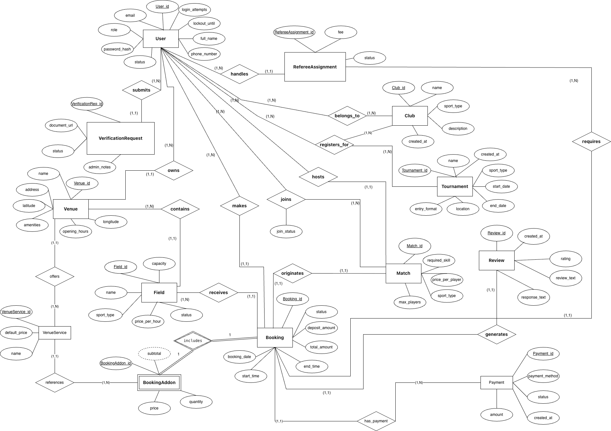

[<u>Link ER</u>](https://drive.google.com/file/d/1JmQ9N6nN_VgcxeZwSjaA-mR4yqVQDAEC/view?usp=drive_link)

[<u>Link ER</u>](https://drive.google.com/file/d/14Pikvgc2SlzUK8gz4qpLk13TWO9FKGXk/view?usp=drive_link) [<u>Draw.io</u>](http://draw.io)

| **Seq** | **Entity Name** | **Description** | **Relationships** |
|----|----|----|----|
| 1 | **User** | Represents a registered account on the platform (Player, Venue Owner, Referee, Admin), storing login credentials, profile data (name, phone number), and status. | Submits VerificationRequests; Owns Venues; Makes Bookings; Receives RefereeAssignments; Joins Matches; Hosts Matches; Registers for Tournaments. |
| 2 | **VerificationRequest** | Represents a verification request containing business licenses or credentials submitted by a Venue Owner or Referee to the system. | Submitted by a User. |
| 3 | **Venue** | Represents a sports facility, storing location data (coordinates, address), a list of amenities, and opening hours. | Owned by a User; Contains Fields. |
| 4 | **Field** | Represents a specific playing field/court within a facility, storing the sport type, name, hourly price, capacity, and status. | Contained within a Venue; Reserved in a Booking. |
| 5 | **Booking** | Represents a customer's field reservation, tracking the time slot, total amount, deposit amount, and status. | Made by a User; Reserves a Field; Includes BookingAddons; Generates a Review; Handles RefereeAssignments. |
| 6 | **BookingAddon** | Represents add-on services (e.g., equipment rental, drinks) added to a reservation, tracking the quantity, price, and subtotal. | Included in a Booking. |
| 7 | **Review** | Represents a customer's feedback after completing a booking, storing the rating and review text. | Generated from a Booking. |
| 8 | **Match** | Represents a matchmaking session, storing the required skill level, price per player, maximum number of players, and sport type. | Hosted by a User; Joined by Users. |
| 9 | **Tournament** | Represents a sports tournament, storing the tournament name, schedule, location, and entry format. | Receives registrations (registers_for) from Users or Clubs. |
| 10 | **Club** | Represents a sports club or group of players on the platform. | Registers for Tournaments. |
| 11 | **RefereeAssignment** | Represents the assignment of a referee to a match/booking, storing the fee and acceptance status. | Handled through a Booking; Received by a User (acting as a Referee). |
| 12 | **Payment** | Represents a payment transaction for a booking, storing the amount, payment method, and status. | Processes payments for a Booking. |
| 13 | **VenueService** | Represents a catalog of fixed add-on services set up by the venue owner, storing the service name and default price. | Offered by a Venue; Referenced by BookingAddons. |

#  3. Architectural Design

## 3.1 Architecture Diagram

### 3.1.1.System Decomposition Tree

### 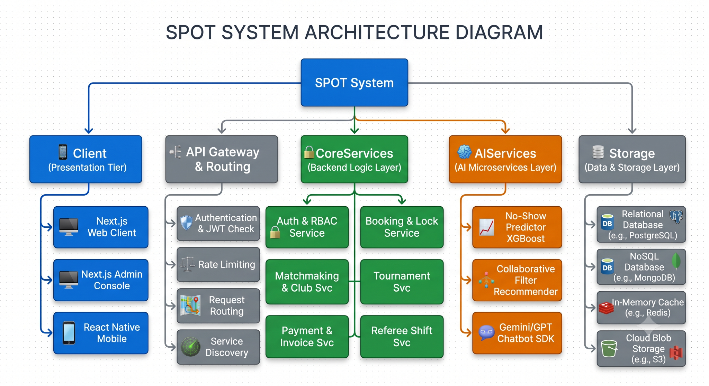

### 3.1.2.Overall System Architecture

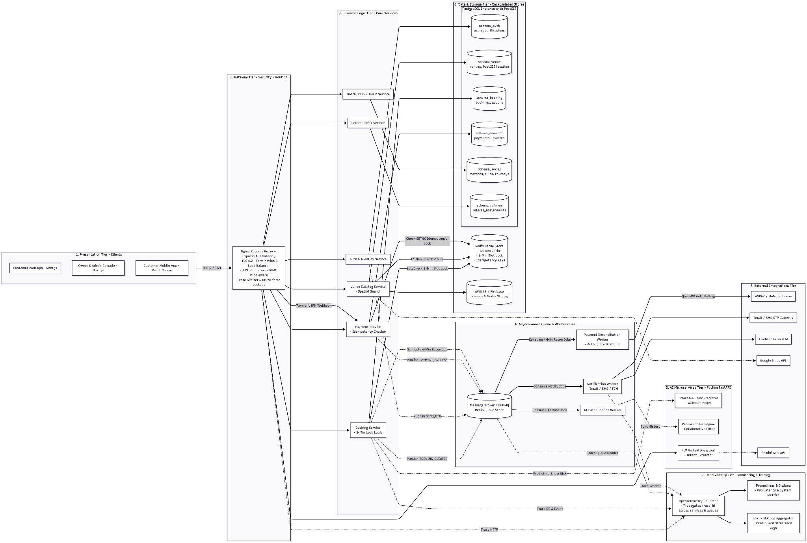

[<u>Link Overall System Architecture</u>](https://drive.google.com/file/d/1VRM1H7TYDw-IYRoRn4vPCen1GpztmAjr/view?usp=drive_link)

## 3.2 Class Diagram

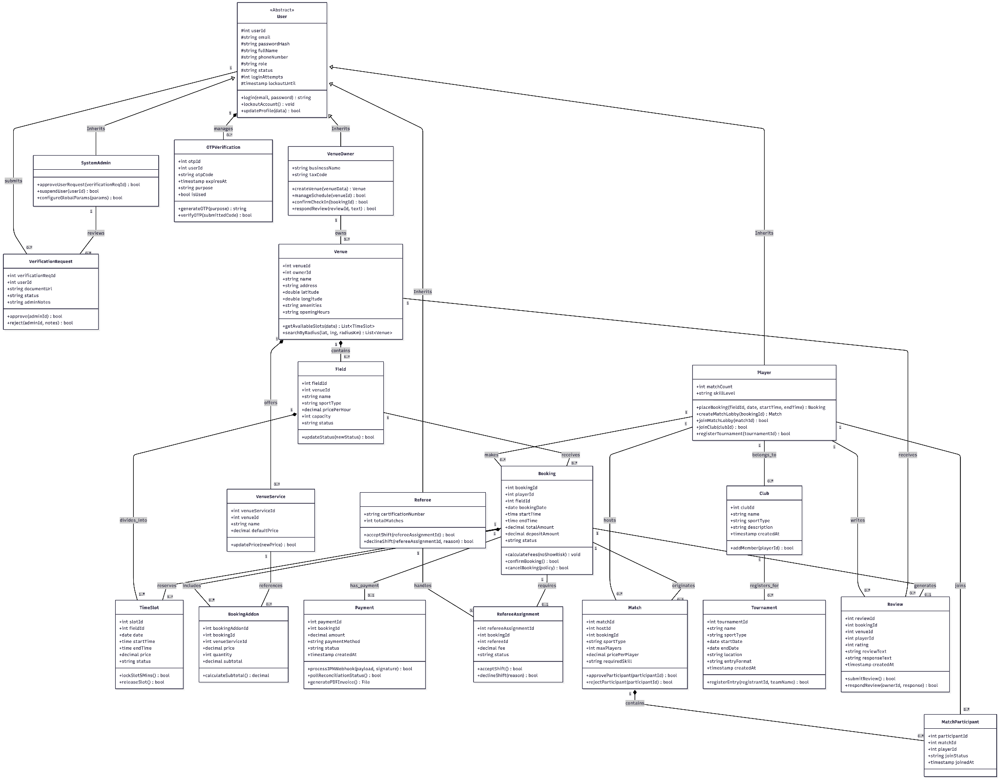

[<u>Link Class Diagram</u>](https://drive.google.com/file/d/1RavqcOPlmReJ_TYGaaNZwyVRLyooExoS/view?usp=drive_link)

## 3.3 Class Specifications

### 3.3.1 Superclass: User (Abstract)

List of Attributes:

| **Seq** | **Property** | **Modifier** | **Constraint** | **Description** |
|----|----|----|----|----|
| 1 | userId | Protected | Primary Key | Unique user identification code |
| 2 | email | Public | Unique,Valid Email | User account login email |
| 3 | passwordHash | Protected | Argon2 / Bcrypt Hash | Encrypted password string |
| 4 | fullName | Protected | Not Null | User's full legal name |
| 5 | phoneNumber | Protected | Unique,Valid Format | Primary contact phone number |
| 6 | role | Protected | Enum:PLAYER, OWNER, REFEREE, ADMIN | Access control role |
| 7 | status | Protected | Enum:ACTIVE, PENDING, LOCKED | Operational account state |
| 8 | loginAttempts | Protected | Default: 0 | Counter for failed login attempts |
| 8 | lockoutUntil | Protected | Nullable Timestamp | Expiry timestamp for 15-minute lockout |

List of Operations:

| **Seq** | **Operation** | **Modifier** | **Constraint** | **Description** |
|----|----|----|----|----|
| 1 | login(email, pass) |  | Returns JWT Token | Authenticates credentials and issues JWT token |
| 2 | lockoutAccount() |  | Triggered when attempts = 5 | Temporarily locks account for 15 minutes |
| 3 | updateProfile(data) |  | Requires OTP for sensitive fields | Updates personal profile attributes |

### 3.3.2 Subclass : Player

List of Attributes:

| **Seq** | **Property** | **Modifier** | **Constraint** | **Description** |
|----|----|----|----|----|
| 1 | matchCount | Public | Default: 0 | Total number of completed sessions |
| 2 | skillLevel | Public | Enum: BEGINNER, INTERMEDIATE, ADVANCED | Player's self-assessed skill rating |

List of Operations:

| **Seq** | **Operation** | **Modifier** | **Constraint** | **Description** |
|----|----|----|----|----|
| 1 | placeBooking(fieldId, date, startTime, endTime) | Public | Returns Booking instance | Creates court reservation and locks slots |
| 2 | createMatchLobby(bookingId) | Public | Requires paid booking | Publishes a friendly match session |
| 3 | joinMatchLobby(matchId) | Public | Match status = OPEN | Requests to join an existing match session |
| 4 | joinClub(clubId) | Public | None | Submits a request to join a sports club |
| 5 | registerTournament(tournamentId) | Public | Entry open | Enrolls in a tournament competition |

### 3.3.3 Subclass : VenueOwner

List of Attributes:

| **Seq** | **Property** | **Modifier** | **Constraint** | **Description** |
|----|----|----|----|----|
| 1 | businessName | Public | Not Null | Registered business entity name |
| 2 | taxCode | Public | Unique String | Official tax identification number |

List of Operations:

| **Seq** | **Operation** | **Modifier** | **Constraint** | **Description** |
|----|----|----|----|----|
| 1 | createVenue(venueData) | Public | Status = APPROVED | Registers a new venue facility |
| 2 | manageSchedule(venueId) | Public | Owner ID matches | Updates field availability and status |
| 3 | confirmCheckIn(bookingId) | Public | Current time \>= Booking time | Marks a booking as checked-in or completed |

### 3.3.4 Class : Venue

List of Attributes:

| **Seq** | **Property** | **Modifier** | **Constraint** | **Description** |
|----|----|----|----|----|
| 1 | venueId | Private | Primary Key | Unique venue identification code |
| 2 | ownerId | Public | Foreign Key -\> VenueOwner.userId | Owner account ID |
| 3 | name | Public | Not Null | Venue facility name |
| 4 | address | Public | Not Null | Physical location address string |
| 5 | latitude | Public | Double (-90.0 to 90.0) | Geographic latitude coordinate |
| 6 | longtitude | Public | Double (-180.0 to 180.0) | Geographic longitude coordinate |

List of Operations:

| **Seq** | **Operation** | **Modifier** | **Constraint** | **Description** |
|----|----|----|----|----|
| 1 | getAvailableSlots(date) | Public | Date format | Queries available fields and time slots |
| 2 | searchByRadius(lat,lng,radiusKm) | Public | PostGIS GIST Index | Performs spatial radius search (\<20ms) |

### 3.3.5 Class : Field

List of Attributes:

| **Seq** | **Property** | **Modifier** | **Constraint** | **Description** |
|----|----|----|----|----|
| 1 | fieldId | Private | Primary Key | Unique field identifier |
| 2 | venueId | Public | Foreign Key -\> Venue.venueId | Parent venue facility ID |
| 3 | name | Public | Not Null | Court name (e.g., Pitch A, Court 1) |
| 4 | sportType | Public | Not Null | Sport category (Football, Badminton, Tennis) |
| 5 | pricePerHour | Public | Decimal \> 0 | Hourly rental price rate |
| 6 | status | Public | Enum: ACTIVE, MAINTENANCE, INACTIVE | Court operational status |

List of Operations:

| **Seq** | **Operation** | **Modifier** | **Constraint** | **Description** |
|----|----|----|----|----|
| 1 | updateStatus(newStatus) | Public | Owner authority | Updates court status (e.g., MAINTENANCE) |

### 3.3.6 Class : TimeSlot

List of Attributes:

| **Seq** | **Property** | **Modifier** | **Constraint** | **Description** |
|----|----|----|----|----|
| 1 | slotId | Private | Primary Key | Unique time slot identifier |
| 2 | fieldId | Public | Foreign Key -\> Field.fieldId | Parent field ID |
| 3 | date | Public | Date | Date of schedule slot |
| 4 | startTime | Public | Time | Slot start time boundary |
| 5 | endTime | Public | Time | Slot end time boundary |
| 6 | status | Public | Enum: AVAILABLE, LOCKED_5M, BOOKED | Current availability state of slot |

List of Operations:

| **Seq** | **Operation** | **Modifier** | **Constraint** | **Description** |
|----|----|----|----|----|
| 1 | lockSlot5Mins() | Public | Redis TTL = 300s | Holds temporary lock on Redis memory |
| 2 | releaseSlot() | Public | Lock exists | Clears lock state if checkout is aborted |

### 3.3.7 Class : Booking

List of Attributes:

| **Seq** | **Property** | **Modifier** | **Constraint** | **Description** |
|----|----|----|----|----|
| 1 | bookingId | Private | Primary Key | Unique booking ticket number |
| 2 | playerId | Public | Foreign Key -\> Player.userId | Customer user ID |
| 3 | fieldId | Public | Foreign Key -\> Field.fieldId | Target field ID |
| 4 | bookingDate | Public | Date | Reserved match date |
| 5 | totalAmount | Public | Decimal \>= 0 | Total price including add-ons |
| 6 | depositAmount | Public | Decimal \>= 0 | Dynamically computed deposit fee |
| 7 | status | Public | Enum:PENDING_PAYMENT,PAID, CHECKED_IN, NO_SHOW, COMPLETED | Booking lifecycle state |

List of Operations:

| **Seq** | **Operation** | **Modifier** | **Constraint** | **Description** |
|----|----|----|----|----|
| 1 | calculateFees(noShowRisk) | Public | Risk 0.0 to 1.0 | Adjusts deposit based on AI No-Show prediction |
| 2 | confirmBooking() | Public | Payment=SUCCESS | Transitions booking state to PAID |
| 3 | cancelBooking(policy) | Public | Check cancellation policy | Cancels reservation |

### 3.3.8 Class : Payment

List of Attributes:

| **Seq** | **Property** | **Modifier** | **Constraint** | **Description** |
|----|----|----|----|----|
| 1 | paymentId | Private | Primary Key | Unique payment record ID |
| 2 | bookingId | Public | Foreign Key -\> Booking.bookingId | Target booking ID |
| 3 | amount | Public | Decimal \>= 0 | Processed monetary amount |
| 4 | paymentMethod | Public | Enum:ONLINE, COUNTER | Processed monetary amount |
| 5 | status | Public | Enum: PENDING, SUCCESS, FAILED | Payment method path |

List of Operations:

| **Seq** | **Operation** | **Modifier** | **Constraint** | **Description** |
|----|----|----|----|----|
| 1 | processIPNWebhook(payload, signature) | Public | Redis SETNX lock check | Handles webhooks safely without duplicate crediting |
| 2 | pollReconciliationStatus() | Public | 4-minute delay | Polling QueryDR API if IPN is dropped |
| 3 | generatePDFInvoice() | Public | Returns PDF Stream | Generates printable PDF receipt |

### 3.3.9 Class : RefereeAssignment

List of Attributes:

| **Seq** | **Property** | **Modifier** | **Constraint** | **Description** |
|----|----|----|----|----|
| 1 | refereeAssignmentId | Private | Primary Key | Unique shift assignment ID |
| 2 | bookingId | Public | Foreign Key -\> Booking.bookingId | Target booking ID |
| 3 | refereeId | Public | Foreign Key -\> Referee.userId | Assigned referee ID |
| 4 | fee | Public | Decimal \>= 0 | Officiating fee for the shift |
| 5 | status | Public | Enum: PENDING, ACCEPTED, DECLINED | Shift acceptance status |

List of Operations:

| **Seq** | **Operation** | **Modifier** | **Constraint** | **Description** |
|----|----|----|----|----|
| 1 | acceptShift() | Public | Status = PENDING | Accepts officiating assignment |
| 2 | declineShift(reason) | Public | Status = PENDING | Declines assignment with reason |

### 3.3.10 Class : Match

List of Attributes:

| **Seq** | **Property** | **Modifier** | **Constraint** | **Description** |
|----|----|----|----|----|
| 1 | matchId | Private | Primary Key | Unique match lobby ID |
| 2 | hostId | Public | Foreign Key -\> Player.userId | Match host player ID |
| 3 | bookingId | Public | Foreign Key -\> Booking.bookingId | Associated confirmed booking ID |
| 4 | sportType | Public | Not Null | Sport category |
| 5 | maxPlayers | Public | Integer \> 0 | Maximum player capacity |
| 6 | pricePerPlayer | Public | Decimal \>= 0 | Cost share per joining player |
| 7 | requiredSkill | Public | Enum: BEGINNER, INTERMEDIATE, ADVANCED | Required skill level |

List of Operations:

| **Seq** | **Operation** | **Modifier** | **Constraint** | **Description** |
|----|----|----|----|----|
| 1 | approveParticipant(participantId) | Public | Host authority | Approves a player's join request |
| 2 | rejectParticipant(participantId) | Public | Host authority | Rejects a player's join request |

# 4. Data Design

## 4.1 Data Diagram

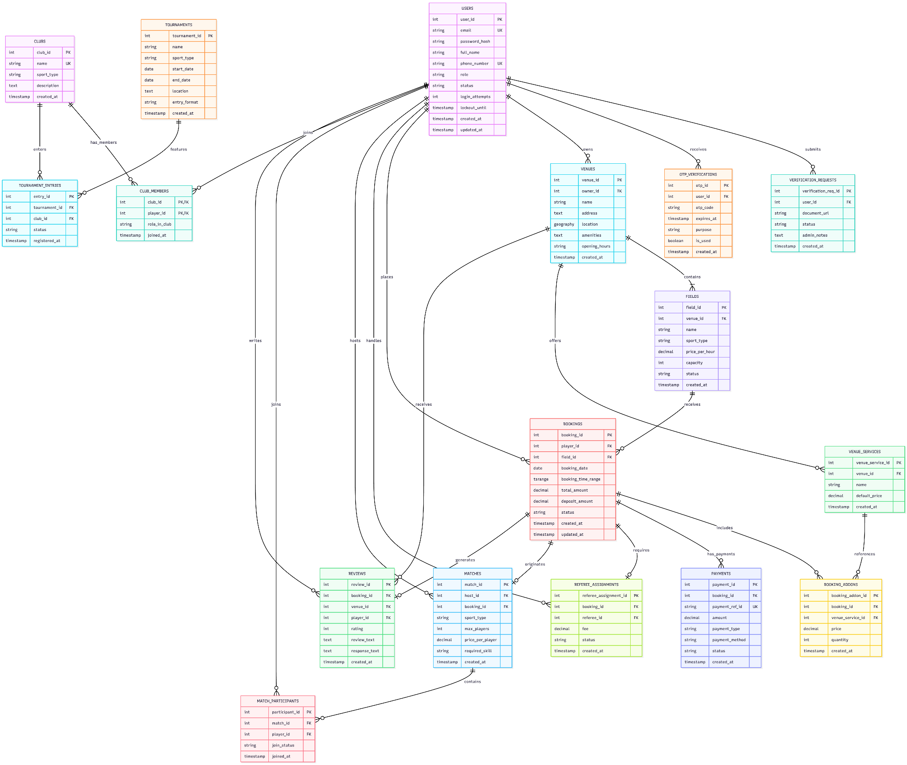

[<u>Link Data Diagram</u>](https://drive.google.com/file/d/1FyyTzUYyeBWgdga_K_RuaqnP1nJBRfVu/view?usp=drive_link)

## 4.2 Data Specification

### 4.2.1. Relational Database Tables (PostgreSQL - Logical Schemas)

#### 4.2.1.1. Logical Schema: schema_auth

**Table 1.1: schema_auth.users**

**Description**: Stores user identity accounts, hashed credentials, security lockout counters, and RBAC roles

| **Attribute** | **Data Type** | **Constraint** | **Description** |
|----|----|----|----|
| user_id | SERIAL | Primary Key | Unique user identification number |
| email | VARCHAR(150) | UNIQUE, NOT NULL | Account login email address |
| password_hash | VARCHAR(255) | NOT NULL | Argon2 / Bcrypt encrypted password hash |
| full_name | VARCHAR(100) | NOT NULL | User's full legal name |
| phone_number | VARCHAR(15) | UNIQUE, NOT NULL | Primary contact phone number |
| role | VARCHAR(20) | ENUM('PLAYER','OWNER','REFEREE','ADMIN') | RBAC access control role |
| status | VARCHAR(20) | ENUM('ACTIVE','PENDING','LOCKED') | Operational account state |
| login_attempts | INT | DEFAULT 0 | Counter for failed consecutive login attempts |
| lockout_until | TIMESTAMP | NULLABLE | Expiry timestamp for 15-minute lockout |
| created_at | TIMESTAMP | DEFAULT CURRENT_TIMESTAMP | Account creation timestamp |
| updated_at | TIMESTAMP | DEFAULT CURRENT_TIMESTAMP | Account profile update timestamp |

**Table 1.2: schema_auth.verification_requests**

**Description**: Stores legal business licenses and referee credentials queued for Admin review.

| **Attribute** | **Data Type** | **Constraint** | **Description** |
|----|----|----|----|
| verification_req_id | SERIAL | Primary Key | Unique verification request ID |
| user_id | INT | FK-\>schema_auth.users(user_id) | Applicant user ID |
| document_url | VARCHAR(255) | NOT NULL | S3/Firebase URL to attached credential document |
| status | VARCHAR(20) | ENUM('PENDING','APPROVED','REJECTED') | Admin review status |
| admin_notes | TEXT | NULLABLE | Administrative review notes or rejection reason |
| created_at | TIMESTAMP | DEFAULT CURRENT_TIMESTAMP | Submission timestamp |

**Table 1.3**: **schema_auth.otp_verifications**

**Description**: Stores 6-digit one-time password hashes with 5-minute TTL for sensitive actions.

| **Attribute** | **Data Type** | **Constraint** | **Description** |
|----|----|----|----|
| otp_id | SERIAL | Primary Key | Unique OTP record ID |
| user_id | INT | FK-\>schema_auth.users(user_id) | Target recipient user ID |
| otp_code | VARCHAR(10) | NOT NULL | Hashed 6-digit verification code |
| expires_at | TIMESTAMP | NOT NULL | Expiration timestamp (5 minutes TTL) |
| purpose | VARCHAR(50) | NOT NULL | Reason for issuance (e.g., FORGOT_PASSWORD) |
| is_used | BOOLEAN | DEFAULT FALSE | Flag indicating if code has been consumed |
| created_at | TIMESTAMP | DEFAULT CURRENT_TIMESTAMP | OTP generation timestamp |

#### 4.2.1.2. Logical Schema: schema_venue

**Table** **2.1**: **schema_venue.venues (PostGIS Extension Enabled)**

**Description**: Stores sports complex center metadata and PostGIS geographic spatial coordinates.

| **Attribute** | **Data Type** | **Constraint** | **Description** |
|----|----|----|----|
| venue_id | SERIAL | Primary Key | Unique venue facility code |
| owner_id | INT | FK-\> schema_auth.users(user_id) | Linked Venue Owner user ID |
| name | VARCHAR(150) | NOT NULL | Venue facility name |
| address | TEXT | NOT NULL | Physical address string |
| location | GEOGRAPHY(Point, 4326) | GIST Spatial Index | Longitude & Latitude point for ST_DWithin radius search |
| amenities | TEXT | NULLABLE | Available amenities (Wifi, Parking, Locker rooms) |
| opening_hours | VARCHAR(100) | NULLABLE | Operating daily time window |
| created_at | TIMESTAMP | DEFAULT CURRENT_TIMESTAMP | Record creation timestamp |
| updated_at | TIMESTAMP | DEFAULT CURRENT_TIMESTAMP | Record update timestamp |

**Table 2.2**: **schema_venue.venue_services**

**Description**: Add-on services offered at a specific venue (e.g., referee hiring, drink crates, equipment rental).

| **Attribute** | **Data Type** | **Constraint** | **Description** |
|----|----|----|----|
| venue_service_id | SERIAL | Primary Key | Unique venue service identification code. |
| venue_id | INT | FK-\>schema_venue.venues(venue_id) | Parent venue facility ID |
| name | VARCHAR(100) | NOT NULL | Add-on service title |
| default_price | DECIMAL(10,2) | NOT NULL, \>= 0 | Default unit price for rental/purchase |
| created_at | TIMESTAMP | DEFAULT CURRENT_TIMESTAMP | Record creation timestamp |

**Table 2.3**: **schema_venue.fields**

**Description**: Individual court or pitch within a venue facility.

<table>
<colgroup>
<col style="width: 23%" />
<col style="width: 20%" />
<col style="width: 21%" />
<col style="width: 34%" />
</colgroup>
<thead>
<tr>
<th><strong>Attribute</strong></th>
<th><strong>Data Type</strong></th>
<th><strong>Constraint</strong></th>
<th><strong>Description</strong></th>
</tr>
<tr>
<th>field_id</th>
<th>SERIAL</th>
<th>Primary Key</th>
<th>Unique field identifier</th>
</tr>
<tr>
<th>venue_id</th>
<th>INT</th>
<th>FK-&gt;schema_venue.venues(venue_id)</th>
<th>Parent venue facility ID</th>
</tr>
<tr>
<th>name</th>
<th>VARCHAR(100)</th>
<th>NOT NULL</th>
<th>Court name (Pitch A, Court 1)</th>
</tr>
<tr>
<th>sport_type</th>
<th>VARCHAR(50)</th>
<th>NOT NULL</th>
<th>Sport category (Football, Badminton, Tennis)</th>
</tr>
<tr>
<th>price_per_hour</th>
<th>DECIMAL(10,2)</th>
<th>NOT NULL, &gt; 0</th>
<th>Hourly rental rate</th>
</tr>
<tr>
<th>capacity</th>
<th>INT</th>
<th>DEFAULT 10</th>
<th>Maximum player capacity</th>
</tr>
<tr>
<th>status</th>
<th>VARCHAR(20)</th>
<th>
ENUM('ACTIVE','MAINTENANCE'

,'INACTIVE')
</th>
<th>Court operational status</th>
</tr>
<tr>
<th>created_at</th>
<th>TIMESTAMP</th>
<th>DEFAULT CURRENT_TIMESTAMP</th>
<th>Record creation timestamp</th>
</tr>
</thead>
<tbody>
</tbody>
</table>

#### 4.2.1.3. Logical Schema: schema_booking

**Table 3.1**: **schema_booking.bookings (Physical STRANGE Overlap Constraint)**

**Description**: Stores reservation ticket transactions with PostgreSQL TSRANGE time bounds to eliminate double-booking at the physical DB level.

| **Attribute** | **Data Type** | **Constraint** | **Description** |
|----|----|----|----|
| booking_id | SERIAL | Primary Key | Unique booking ticket number |
| player_id | INT | FK-\>schema_auth.users(user_id) | Reserving customer user ID |
| field_id | INT | FK-\>schema_venue.fields(field_id) | Target court ID |
| booking_date | DATE | NOT NULL | Reserved match date |
| booking_time_range | TSRANGE | NOT NULL, EXCLUDE GIST | Timestamp range representing start_time and end_time |
| total_amount | DECIMAL(10,2) | NOT NULL, \>= 0 | Total payable price including add-ons. |
| deposit_amount | DECIMAL(10,2) | NOT NULL, \>= 0 | Dynamically computed deposit fee |
| status | VARCHAR(30) | ENUM('PENDING_PAYMENT','PAID','CHECKED_IN','NO_SHOW','COMPLETED') | Booking lifecycle status |
| created_at | TIMESTAMP | DEFAULT CURRENT_TIMESTAMP | Reservation creation timestamp |
| updated_at | TIMESTAMP | DEFAULT CURRENT_TIMESTAMP | Reservation status update timestamp |

**Table 3.2**: **schema_booking.booking_addons (Weak Entity)**

**Description**: Stores add-on items attached to a specific booking ticket.

| **Attribute** | **Data Type** | **Constraint** | **Description** |
|----|----|----|----|
| booking_addon_id | SERIAL | Primary Key | Unique add-on item record ID |
| booking_id | INT | FK-\>schema_booking.bookings(booking_id) | Parent booking ID |
| venue_service_id | INT | FK-\>schema_venue.venue_services(venue_service_id) | Referenced venue service ID |
| price | DECIMAL(10,2) | NOT NULL, \>= 0 | Unit price at time of booking |
| quantity | INT | DEFAULT 1, \> 0 | Quantity ordered |
| created_at | TIMESTAMP | DEFAULT CURRENT_TIMESTAMP | Item addition timestamp |

#### 4.2.1.4. Logical Schema: schema_payment

**Table 4.1:** **schema_payment.payments (Multi-Payment Support)**

**Description**: Stores individual payment transactions supporting online deposits and counter remaining balances

| **Attribute** | **Data Type** | **Constraint** | **Description** |
|----|----|----|----|
| payment_id | SERIAL | Primary Key | Unique payment record ID |
| booking_id | INT | FK-\>schema_booking.bookings(booking_id) | Associated booking ID |
| payment_ref_id | VARCHAR(100) | UNIQUE, NULLABLE | Gateway reference transaction code |
| amount | DECIMAL(10,2) | NOT NULL, \> 0 | Processed monetary amount |
| payment_type | VARCHAR(20) | ENUM('DEPOSIT', 'REMAINING', 'FULL') | Payment installment type |
| payment_method | VARCHAR(20) | ENUM('ONLINE', 'COUNTER') | Chosen payment path |
| status | VARCHAR(20) | ENUM('PENDING', 'SUCCESS', 'FAILED') | Payment settlement status |
| created_at | TIMESTAMP | DEFAULT CURRENT_TIMESTAMP | Transaction timestamp |
| updated_at | TIMESTAMP | DEFAULT CURRENT_TIMESTAMP | Status update timestamp |

#### 4.2.1.5. Logical Schema: schema_referee

**Table 5.1: schema_referee.referee_assignments**

**Description**: Officiating shift assignments for booked matches.

| **Attribute** | **Data Type** | **Constraint** | **Description** |
|----|----|----|----|
| referee_assignment_id | SERIAL | Primary Key | Unique shift assignment ID |
| booking_id | INT | FK -\> schema_booking.bookings(booking_id) | Target booking ID |
| referee_id | INT | FK -\> schema_auth.users(user_id) | Assigned referee ID |
| fee | DECIMAL(10,2) | NOT NULL, \>= 0 | Officiating fee for the shift |
| status | VARCHAR(20) | ENUM('PENDING', 'ACCEPTED', 'DECLINED') | Shift acceptance status |
| created_at | TIMESTAMP | DEFAULT CURRENT_TIMESTAMP | Assignment creation timestamp |

#### 4.2.1.6. Logical Schema: schema_social

**Table 6.1: schema_social.matches**

**Description**: Friendly match lobbies created by hosts seeking extra players.

| **Attribute** | **Data Type** | **Constraint** | **Description** |
|----|----|----|----|
| match_id | SERIAL | Primary Key | Unique match lobby ID |
| host_id | INT | FK -\> schema_auth.users(user_id) | Match host player ID |
| booking_id | INT | FK -\> schema_booking.bookings(booking_id) | Associated confirmed booking ID |
| sport_type | VARCHAR(50) | NOT NULL | Sport category |
| max_players | INT | NOT NULL, \> 0 | Maximum player capacity |
| price_per_player | DECIMAL(10,2) | DEFAULT 0.00 | Cost share per joining player |
| required_skill | VARCHAR(20) | ENUM('BEGINNER','INTERMEDIATE','ADVANCED') | Required skill level |
| created_at | TIMESTAMP | DEFAULT CURRENT_TIMESTAMP | Lobby creation timestamp |

**Table 6.2: schema_social.match_participants (Association Table)**

**Description**: Participant join requests and approval status for match lobbies.

| **Attribute** | **Data Type** | **Constraint** | **Description** |
|----|----|----|----|
| participant_id | SERIAL | Primary Key | Unique participant record ID |
| match_id | INT | FK-\>schema_social.matches(match_id) | Target match session ID |
| player_id | INT | FK-\>schema_auth.users(user_id) | Requesting player ID |
| join_status | VARCHAR(20) | ENUM('PENDING','APPROVED','REJECTED','KICKED') | Host approval status |
| joined_at | TIMESTAMP | DEFAULT CURRENT_TIMESTAMP | Request timestamp |

**Table 6.3: schema_social.clubs**

**Description**: Sports clubs and group rosters.

| **Attribute** | **Data Type** | **Constraint** | **Description** |
|----|----|----|----|
| club_id | SERIAL | Primary Key | Unique club identifier |
| name | VARCHAR(100) | UNIQUE, NOT NULL | Club name |
| sport_type | VARCHAR(50) | NOT NULL | Primary sport activity |
| description | TEXT | NULLABLE | Club guidelines and description |
| created_at | TIMESTAMP | DEFAULT CURRENT_TIMESTAMP | Foundation timestamp |

**Table 6.4: schema_social.club_members (M:N Junction Table)**

**Description**: Junction table connecting Users to multiple Clubs with club roles.

| **Attribute** | **Data Type** | **Constraint** | **Description** |
|----|----|----|----|
| club_id | INT | PK,FK-\>schema_social.clubs(club_id) | Target club ID |
| player_id | INT | PK,FK-\> schema_auth.users(user_id) | Member player ID |
| role_in_club | VARCHAR(20) | ENUM('CAPTAIN', 'MEMBER') | Role within the club |
| joined_at | TIMESTAMP | DEFAULT CURRENT_TIMESTAMP | Membership join timestamp |

**Table 6.5: schema_social.tournaments**

**Description**: Tournament events and competition details.

| **Attribute** | **Data Type** | **Constraint** | **Description** |
|----|----|----|----|
| tournament_id | SERIAL | Primary Key | Unique tournament ID |
| name | VARCHAR(150) | NOT NULL | Tournament title |
| sport_type | VARCHAR(50) | NOT NULL | Sport category |
| start_date | DATE | NOT NULL | Tournament opening date |
| end_date | DATE | NOT NULL | Tournament conclusion date |
| location | TEXT | NOT NULL | Venue address or facility name |
| entry_format | VARCHAR(20) | ENUM('SINGLES', 'DOUBLES', 'TEAMS') | Competition entry format |
| created_at | TIMESTAMP | DEFAULT CURRENT_TIMESTAMP | Creation timestamp |

**Table 6.6: schema_social.tournament_entries (M:N Junction Table)**

**Description**: Junction table registering Clubs for Tournaments.

| **Attribute** | **Data Type** | **Constraint** | **Description** |
|----|----|----|----|
| entry_id | SERIAL | Primary Key | Unique entry record ID |
| tournament_id | INT | FK-\>schema_social.tournaments(tournament_id) | Target tournament ID |
| club_id | INT | FK-\>schema_social.clubs(club_id) | Enrolled club ID |
| status | VARCHAR(20) | ENUM('PENDING', 'CONFIRMED', 'REJECTED') | Entry approval status. |
| registered_at | TIMESTAMP | DEFAULT CURRENT_TIMESTAMP | Registration timestamp |

#### 4.2.1.7. Logical Schema: schema_review

**Table 7.1: schema_review.reviews**

**Description**: Stores post-booking reviews, ratings, and owner responses.

| **Attribute** | **Data Type** | **Constraint** | **Description** |
|----|----|----|----|
| review_id | SERIAL | Primary Key | Unique review ID |
| booking_id | INT | UNIQUE,FK-\>schema_booking.bookings(booking_id) | Related completed booking ID |
| venue_id | INT | FK-\>schema_venue.venues(venue_id) | Target venue ID |
| player_id | INT | FK -\> schema_auth.users(user_id) | Author player ID |
| rating | INT | CHECK(rating BETWEEN 1 AND 5) | Star rating (1 to 5 stars) |
| review_text | TEXT | NULLABLE | Review comment text |
| response_text | TEXT | NULLABLE | Venue owner's response text |
| created_at | TIMESTAMP | DEFAULT CURRENT_TIMESTAMP | Submission timestamp |

### 4.2.2.. In-Memory Data Structures (Redis Cache Keys)

| **Key Pattern** | **Data Structure** | **TTL** | **Description / Purpose** |
|----|----|----|----|
| lock:slot:{field_id}:{date}:{start_time} | String (user_id) | 300 seconds | 5-Minute Ephemeral Slot Lock: Holds slot temporarily during checkout to guarantee 0% double-booking and \< 50ms latency |
| geo:venues:{sport_type} | Redis GeoSet | Infinite | L1 Geo Search Cache: Stores venue geographic points for instant GEOSEARCH radius queries (\< 5ms) |
| lock:ipn:{payment_ref_id} | String (SETNX) | 30 seconds | Payment Idempotency Lock: Prevents duplicate VNPAY/MoMo IPN webhook executions |
| sess:user:{user_id} | Hash | 86400 seconds | Active Session Cache: Stores active user token claims and role permissions for fast JWT validation |

#  

# 5 User Interface and User Experience Design

## 5.1. Screen Diagram

Screen Diagram for Player/Host Match Link: [<u>Access Link Here</u>](https://drive.google.com/drive/folders/1jUa81dOzXOC0tfMriqPGS8dhPkTz64rK?usp=sharing)

UI/UX Screen Link: [<u>Access Link Here</u>](https://drive.google.com/drive/folders/1_QpyIO4dC4kjKYYUrR7Dy3vLmwZTH5tN?usp=sharing)

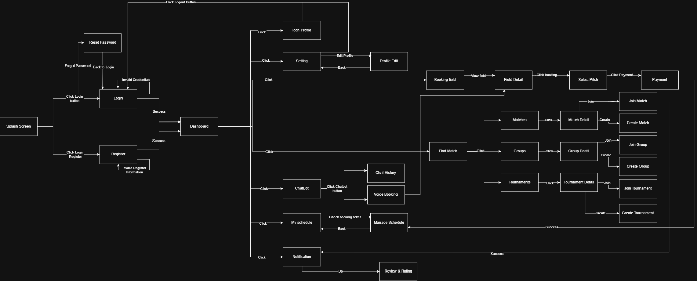

| **Seq** | **Screen** | **Description** |
|----|----|----|
| 1 | Splash Screen | The initial launch screen, branching to Login or Register. |
| 2 | Login | Login screen. Receives flow from Splash Screen or Back to Login from Reset Password. Proceeds to Dashboard upon Success. |
| 3 | Register | Registration screen. Receives flow from Splash Screen. Proceeds to Dashboard upon Success. |
| 4 | Reset Password | Password recovery screen. Accessed via the "Forgot Password" branch from Login. |
| 5 | Dashboard | The main navigation hub, connecting to all core features of the app. |
| 6 | Icon Profile | Accessed from Dashboard. Contains a Logout Button that routes the user straight back to Login. |
| 7 | Setting | Accessed from Dashboard. Navigates to the Profile Edit screen. |
| 8 | Profile Edit | Edit personal information. Accessed from Setting (Edit Profile) and allows returning via a Back flow. |
| 9 | Booking field | Venue list screen. Accessed from Dashboard or Voice Booking. Navigates to Field Detail. |
| 10 | Field Detail | Venue details. Accessed from Booking field (View field). Navigates to Select Pitch. |
| 11 | Select Pitch | Choose pitch and time. Accessed from Field Detail (Click booking). Navigates to Payment. |
| 12 | Payment | Checkout screen (Click Payment from Select Pitch). A Success event routes back to Dashboard and sends a flow to Notification. |
| 13 | Find Match | Main matchmaking screen, accessed from Dashboard. Branches into Matches, Groups, and Tournaments. |
| 14 | Matches | List of drop-in matches. Accessed from Find Match, navigates to Match Detail. |
| 15 | Match Detail | Match specifics. Branches into Join Match or Create Match screens. |
| 16 | Join Match | Screen to join an existing match. |
| 17 | Create Match | Screen to host a new match. |
| 18 | Groups | List of communities/groups. Accessed from Find Match, navigates to Group Deatial. |
| 19 | Group Detail | Group specifics. Branches into Join Group or Create Group screens. |
| 20 | Join Group | Screen to join an existing group. |
| 21 | Create Group | Screen to form a new group. |
| 22 | Tournaments | List of tournaments. Accessed from Find Match, navigates to Tournament Detail. |
| 23 | Tournament Detail | Tournament specifics. Branches into Join Tournament or Create Tournament screens. |
| 24 | Join Tournament | Screen to register for an ongoing tournament. |
| 25 | Create Tournament | Screen to organize a new tournament. |
| 26 | ChatBot | AI assistant feature, accessed from Dashboard. |
| 27 | Chat History | View past conversations, accessed via the ChatBot button branch. |
| 28 | Voice Booking | Voice-activated booking. Accessed via ChatBot button and routes directly to the Booking field. |
| 29 | My schedule | Itinerary screen, accessed from Dashboard. |
| 30 | Manage Schedule | Schedule management, accessed from My schedule (Check booking ticket) and allows returning via a Back flow. |
| 31 | Notification | Notification center, accessed from Dashboard or receives a Success trigger from Payment. |
| 32 | Review & Rating | Feedback screen, initiated via a "Do" action from Notification. |

##  

## 5.2. Screen Specifications

### 5.2.1. Screen “Booking field homepage”

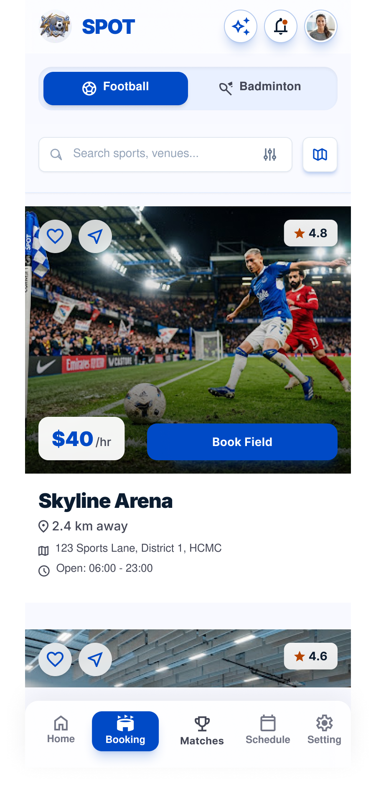

**Presentation format**

- **Top Navigation Bar**: Located at the top, displaying the SPOT logo, an AI assistant icon, a notification bell icon, and the user profile avatar.

- **Sport Category Switcher**: Two prominent toggle buttons allowing users to switch between "Football" (active) and "Badminton".

- **Search and Filter Bar**: A search input field integrated with a filter icon and a map view toggle icon.

- **Venues List**: A vertically scrollable list of available sports facilities (e.g., Skyline Arena, Metro Futsal Hub) featuring:

  - High-quality venue images.

  - Rating badge (e.g., 4.8 stars).

  - Hourly rental price overlay.

  - Detailed information: Distance, address, and operating hours.

  - Secondary Interaction Buttons: A favorite (heart) button and a share button overlaid on each venue's image.

  - Main Action Button: A prominent blue "Book Field" button for each listing.

- **Bottom Navigation Bar**: Fixed at the bottom containing five primary tabs: Home, Booking (active), Matches, Schedule, and Setting.

**Event handling**

- **Click "Football" / "Badminton" tab**: Action: Switches the active sport category and filters the venue list accordingly.

- **Click Search input / Filter / Map icon**: Action: Activates text entry, opens advanced filtering parameters, or switches the list view to a map layout.

- **Click "Book Field" on a specific venue**: Action: Opens the time slot selection and booking confirmation interface for that specific venue.

- **Click Favorite (Heart) icon**: Action: Saves the venue to the user's favorites list; the icon toggles its state (e.g., filled/outlined).

- **Click Share icon**: Action: Opens the system sharing dialog for the venue.

- **Click AI assistant, Notification, or Profile avatar**: Action: Navigates to the respective AI chat, notifications panel, or user profile view.

- **Click Bottom Navigation items**: Action: Navigates the user to other main sections of the application.

### 

### 5.2.2. Screen “Voice booking”

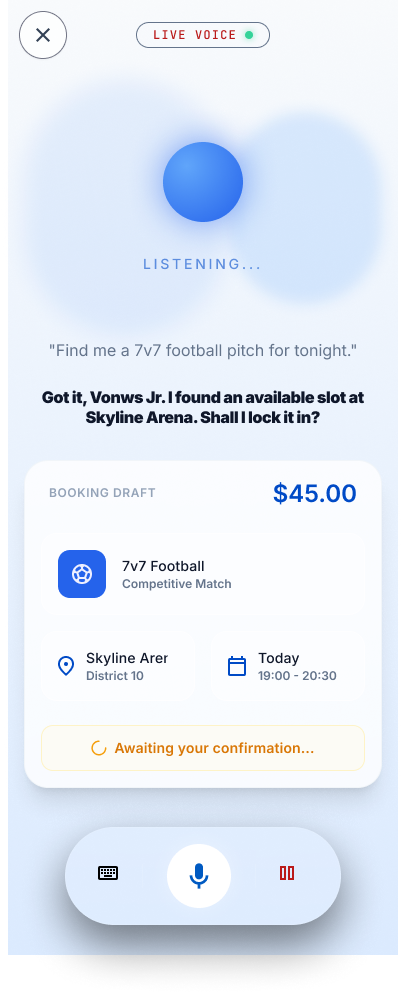

**Presentation format**

- **Top Bar**: Features a close ('X') button on the left and an active status indicator displaying a "LIVE VOICE" label with a green dot on the top center.

- **Voice Animation Area**: Shows a glowing blue sphere and the text "LISTENING..." to indicate active audio reception.

- **Transcript Text**: Displays the user's speech input (e.g., *"Find me a 7v7 football pitch for tonight."*) and the AI's conversational response (*"Got it, Vonws Jr. I found an available slot at Skyline Arena. Shall I lock it in?"*).

- **Booking Draft Card**: A pre-filled summary card created by the AI containing:

  - Estimated total cost in the top right (e.g., \$45.00).

  - Match type details (e.g., 7v7 Football, Competitive Match).

  - Venue location (e.g., Skyline Arer, District 10).

  - Date and time (e.g., Today, 19:00 - 20:30).

  - A status indicator banner stating "Awaiting your confirmation...".

- **Bottom Toolbar**: A floating pill-shaped container holding a keyboard switch button, a glowing active microphone icon in the center, and a pause/stop bars icon.

**Event handling**

- **Click the Close ('X') button**: Action: Exits the live voice assistant interface and returns the user to the previous screen.

- **Click the Keyboard icon**: Action: Switches the input mode from live voice conversation to manual text typing.

- **Click the Microphone icon**: Action: Toggles the microphone state (mutes or resumes voice input).

- **Click the Pause button**: Action: Pauses the current listening state or session of the AI assistant.

### 5.2.3 Screen “Football - Dashboard”

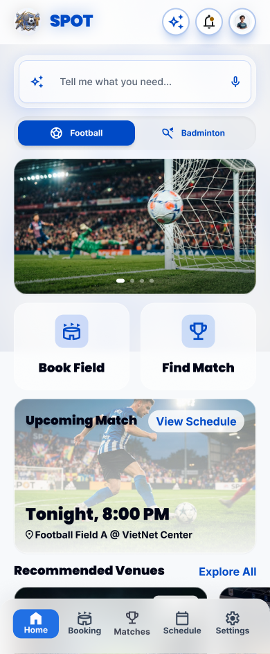

**Presentation format**

- **Search Bar:** A versatile search bar featuring a microphone icon for voice input.

- **Sport Tabs:** Quick toggle buttons to switch between different sports (e.g., Football, Badminton).

- **Main Action Buttons:** Two prominent, large buttons for primary actions: "Book Field" and "Find Match".

- **"Upcoming Match" Card:** Displays the user's next scheduled match, including date, time, and venue name/address.

- **"Recommended Venues" List:** A horizontally scrollable list of suggested venues. Each card includes a cover image, hourly rate, distance (in km), and a rating score.

- **Bottom Navigation Bar:** Contains navigation tabs: Home, Booking, Matches, Schedule, Settings.

**Event handling**

- **Click Microphone Icon (Voice Search):**

  - **Action:** Activates the AI voice assistant and navigates the user to the "Voice booking" screen.

- **Click "Book Field" button:**

  - **Action:** Navigates the user to the venue listing screen ("Football - Dashboard").

- **Click "Find Match" button:**

  - **Action:** Navigates the user to the match discovery screen ("Matches - Homepage").

#### 

#### 

#### 

###  

### 5.2.4. Screen “Matches - Homepage”

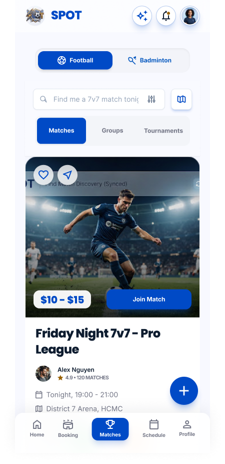

**Presentation format**

- **Content Tabs:** Navigation tabs to switch between "Matches", "Groups", and "Tournaments".

- **Match List:** Displays active matches looking for players (e.g., Friday Night 7v7, Advanced Singles Smash) with the following details:

  - Host avatar and name.

  - Date, time, venue, and distance.

  - Required skill level range (e.g., Amateur -\> Semi-pro).

  - Availability status (e.g., "10 spots left") alongside avatars of joined players.

  - Entry fee.

- **Action Button:** A distinct blue "Join Match" button.

- **Floating Action Button (FAB):** A floating "+" button located at the bottom right corner.

**Event handling**

- **Click "Join Match" button:**

  - **Action:** Submits a request to join the match or redirects the user to the payment screen for the entry fee.

- **Click "+" FAB:**

  - **Action:** Opens a form for the user to create and host a new match.

### 

### 

###  

### 5.2.5.Screen “Referee Invites - Manage Bookings”

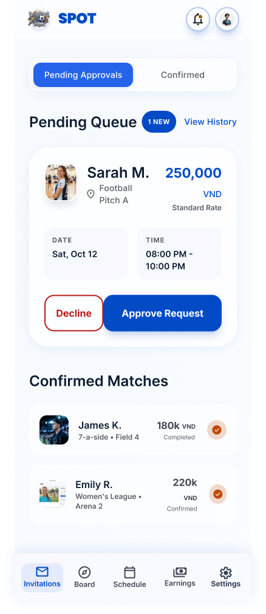

**Presentation format**

- **Status Tabs:** Two main tabs for managing requests: "Pending Approvals" and "Confirmed".

- **Pending Queue Section:** A list of incoming booking or referee requests awaiting action, displaying:

  - Requester's details (Avatar, Name, Venue).

  - Offered compensation/rate (e.g., 250,000 VND - Standard Rate).

  - Specific Date and Time.

  - Two parallel action buttons: "Decline" (red outline) and "Approve Request" (solid blue).

- **Confirmed Matches Section:** A list of previously approved matches showing completion status or upcoming schedule.

**Event handling**

- **Click "Approve Request" button:**

  - **Action:** Accepts the request. The item is moved to the "Confirmed" tab, and a notification is sent to the requester.

- **Click "Decline" button:**

  - **Action:** Rejects the request. The item is removed from the "Pending Queue".

### 

### 

### 

###  

### 5.2.6. Screen “SPOT \| Venue Owner Dashboard (Web)”

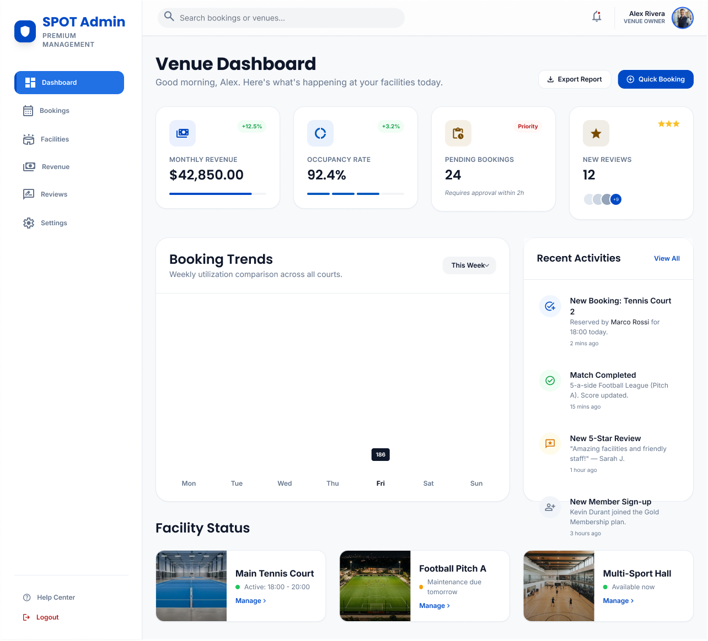

**Presentation format**

- **Sidebar Navigation:** A left-hand menu containing management modules: Dashboard, Bookings, Facilities, Revenue, Reviews, Settings.

- **Top Statistics Cards:** Four summary cards highlighting key performance indicators (KPIs): Monthly Revenue, Occupancy Rate, Pending Bookings (with priority tags), and New Reviews.

- **Booking Trends Chart:** A bar chart visualizing booking volume trends over the days of the week.

- **Recent Activities Panel:** A feed displaying the latest system events (e.g., new bookings, completed matches, new reviews).

- **Facility Status Section:** Quick-glance cards for individual courts/fields (e.g., Main Tennis Court, Football Pitch A) showing their current operational status (Active, Maintenance, Available now) and a "Manage \>" link.

- **Top Right Action Buttons:** "Export Report" and "Quick Booking" buttons.

**Event handling**

- **Click "Quick Booking" button:**

  - **Action:** Opens a modal form allowing the venue owner or staff to manually enter a booking (useful for walk-in or phone reservations).

- **Click "Manage \>" on a Facility card:**

  - **Action:** Redirects to a detailed settings and schedule management page specific to that individual facility.
